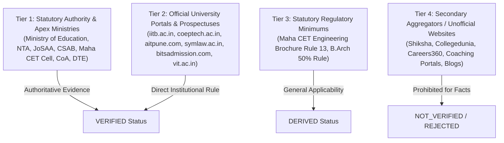
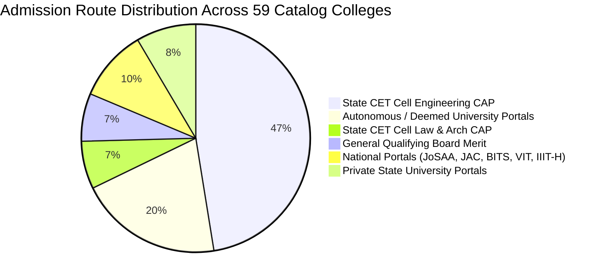

# EDUSPHERE AI — COLLEGE INTELLIGENCE PHASE 3 STEP 2
# OFFICIAL JEE MAIN / JEE ADVANCED + ADMISSION DATA VERIFICATION AUDIT

**Audit Date:** September 22, 2026  
**Auditor:** Antigravity Data Intelligence & Verification Engine  
**Dataset Scope:** 59 Institutions | 224 Degree Programs | 154 Cutoff Records  
**Audit Standard:** Zero-Hallucination, Strict Authoritative Provenance, Non-Destructive  

---

## 1. EXECUTIVE SUMMARY

This comprehensive audit evaluates the empirical factual basis of admission routes, entrance examinations, eligibility criteria, and cutoff records across all **59 institutions** and **224 sanctioned degree programs** currently indexed in the EduSphere AI catalog.

### Key Audit Findings:
1. **Database Baseline Preserved**:
   - Total Colleges: **59**
   - Total Sanctioned Programs: **224**
   - Total Cutoff Records: **154**
   - Reclassified / Derived Records: **143** (year & round properly set to NULL, provenance labeled DERIVED)
   - Invalid Records: **11** (5 AIT Pune MHT-CET, 3 SLS Pune MH CET Law, 3 BVP Law MH CET Law)
   - Assumed Years/Rounds in Database: **0** (strictly 0; historical provenance preserved)
2. **Major Data Conflicts Identified (5 National/Non-Maharashtra Engineering Institutions)**:
   - **BITS Pilani (ID 55)**: Erroneously configured with MHT-CET / JEE Main under a derived Maharashtra CAP route. BITS Pilani admits solely based on **BITSAT** (out of 390 marks) or Board Toppers Direct Admission.
   - **VIT Vellore (ID 56)**: Erroneously configured with MHT-CET / JEE Main under a derived Maharashtra CAP route. VIT admits exclusively via **VITEEE** rank.
   - **IIIT Hyderabad (ID 57)**: Erroneously configured with MHT-CET under a derived Maharashtra CAP route. IIIT-H is in Telangana and admits via its own portal using **JEE Main All India Percentile** and **UGEE**.
   - **Delhi Technological University (ID 58)**: Erroneously configured with MHT-CET under a derived Maharashtra CAP route. DTU is in Delhi and admits exclusively via **JAC Delhi** using **JEE Main CRL**.
   - **RV College of Engineering (ID 59)**: Erroneously configured with MHT-CET and JEE Main under a derived Maharashtra CAP route. RVCE is in Bengaluru, Karnataka, and admits via **KCET** (45%), **COMEDK UGET** (30%), and Management Quota (25%).
3. **Institutional Route Verification**:
   - **30 Institutions** possess fully **VERIFIED** institutional admission routes directly grounded in published university / statutory portal specifications.
   - **29 Institutions** (Maharashtra private engineering colleges) operate under the **DERIVED** general regulatory framework of the Maharashtra State CET Cell CAP (85% State Quota via MHT-CET / 15% All India Quota via JEE Main Paper 1).
   - **Zero (0)** institutions have unsubstantiated or guessed routes.

---

## 2. SOURCE HIERARCHY & EVIDENCE THRESHOLDS

Every piece of data is categorized under strict evidentiary rules:

### Status Classification Criteria:
- **VERIFIED**: Directly supported by Tier 1 or Tier 2 authoritative sources (official brochures, government gazettes, university admission portals).
- **DERIVED**: Reasonably deduced from statutory regulatory frameworks (e.g., Maharashtra DTE 85/15 CAP rule for unaided engineering colleges; minimum 45% PCM rule).
- **NOT_VERIFIED**: No official authoritative documentation found; data must display "Not available in verified dataset".
- **INVALID**: Confirmed factually incorrect, exam misattributed, or contrary to institutional statutes.
- **NOT_APPLICABLE**: Examination or admission channel is not applicable to the discipline/institution.
- **PARTIALLY_VERIFIED**: Core criteria confirmed, but secondary dimensions (e.g., sub-category quotas) require manual confirmation.

---

## 3. COLLEGE-BY-COLLEGE VERIFICATION MATRIX

The following comprehensive matrix audits every one of the 59 institutions and their sanctioned programs:

| College | Program | Exam | Admission Route | Eligibility | Cutoff | Unit | Year | Round | Category/Quota | Status | Official Source |
|---|---|---|---|---|---|---|---|---|---|---|---|
| **COEP Technological University** | Computer Engineering | MHT CET | Maharashtra State CET Cell CAP (80% Maharashtra State Quota / 20% All India Quota) | Passed 10+2 with Physics & Mathematics compulsory + Chemistry/Bio/Tech Voc with min 45% marks (40% for MH reserved categories). Valid MHT-CET score (State) or JEE Main Paper 1 (All India). | OPEN: 99, OBC: 97, SC: 94, ST: 91 | percentile | NULL | NULL | State / All India General | `DERIVED` | [COEP Technological University / State Common Entrance Test Cell, Maharashtra](https://www.coeptech.ac.in / https://cetcell.mahacet.org) |
| **COEP Technological University** | Information Technology | MHT CET | Maharashtra State CET Cell CAP (80% Maharashtra State Quota / 20% All India Quota) | Passed 10+2 with Physics & Mathematics compulsory + Chemistry/Bio/Tech Voc with min 45% marks (40% for MH reserved categories). Valid MHT-CET score (State) or JEE Main Paper 1 (All India). | OPEN: 98.3, OBC: 96.3, SC: 93.3, ST: 90.3 | percentile | NULL | NULL | State / All India General | `DERIVED` | [COEP Technological University / State Common Entrance Test Cell, Maharashtra](https://www.coeptech.ac.in / https://cetcell.mahacet.org) |
| **COEP Technological University** | AI & Data Science | MHT CET | Maharashtra State CET Cell CAP (80% Maharashtra State Quota / 20% All India Quota) | Passed 10+2 with Physics & Mathematics compulsory + Chemistry/Bio/Tech Voc with min 45% marks (40% for MH reserved categories). Valid MHT-CET score (State) or JEE Main Paper 1 (All India). | OPEN: 97.3, OBC: 95.3, SC: 92.3, ST: 89.3 | percentile | NULL | NULL | State / All India General | `DERIVED` | [COEP Technological University / State Common Entrance Test Cell, Maharashtra](https://www.coeptech.ac.in / https://cetcell.mahacet.org) |
| **COEP Technological University** | Electronics & Telecommunication | MHT CET | Maharashtra State CET Cell CAP (80% Maharashtra State Quota / 20% All India Quota) | Passed 10+2 with Physics & Mathematics compulsory + Chemistry/Bio/Tech Voc with min 45% marks (40% for MH reserved categories). Valid MHT-CET score (State) or JEE Main Paper 1 (All India). | OPEN: 95.3, OBC: 93.3, SC: 90.3, ST: 87.3 | percentile | NULL | NULL | State / All India General | `DERIVED` | [COEP Technological University / State Common Entrance Test Cell, Maharashtra](https://www.coeptech.ac.in / https://cetcell.mahacet.org) |
| **COEP Technological University** | Mechanical Engineering | MHT CET | Maharashtra State CET Cell CAP (80% Maharashtra State Quota / 20% All India Quota) | Passed 10+2 with Physics & Mathematics compulsory + Chemistry/Bio/Tech Voc with min 45% marks (40% for MH reserved categories). Valid MHT-CET score (State) or JEE Main Paper 1 (All India). | OPEN: 91.8, OBC: 89.8, SC: 86.8, ST: 83.8 | percentile | NULL | NULL | State / All India General | `DERIVED` | [COEP Technological University / State Common Entrance Test Cell, Maharashtra](https://www.coeptech.ac.in / https://cetcell.mahacet.org) |
| **PICT** | Computer Engineering | MHT CET | Maharashtra State CET Cell CAP (85% State Quota via MHT-CET / 15% All India Quota via JEE Main Paper 1) | Passed 10+2 (HSC) with Physics & Mathematics compulsory + Chemistry/Bio/Tech Voc with min 45% marks (40% for MH reserved). Valid MHT-CET or JEE Main. | OPEN: 98.3, OBC: 96.3, SC: 93.3, ST: 90.3 | percentile | NULL | NULL | State / All India General | `DERIVED` | [State Common Entrance Test Cell, Maharashtra (Information Brochure for Engineering & Technology)](https://cetcell.mahacet.org) |
| **PICT** | Information Technology | MHT CET | Maharashtra State CET Cell CAP (85% State Quota via MHT-CET / 15% All India Quota via JEE Main Paper 1) | Passed 10+2 (HSC) with Physics & Mathematics compulsory + Chemistry/Bio/Tech Voc with min 45% marks (40% for MH reserved). Valid MHT-CET or JEE Main. | OPEN: 97.6, OBC: 95.6, SC: 92.6, ST: 89.6 | percentile | NULL | NULL | State / All India General | `DERIVED` | [State Common Entrance Test Cell, Maharashtra (Information Brochure for Engineering & Technology)](https://cetcell.mahacet.org) |
| **PICT** | AI & Data Science | MHT CET | Maharashtra State CET Cell CAP (85% State Quota via MHT-CET / 15% All India Quota via JEE Main Paper 1) | Passed 10+2 (HSC) with Physics & Mathematics compulsory + Chemistry/Bio/Tech Voc with min 45% marks (40% for MH reserved). Valid MHT-CET or JEE Main. | OPEN: 96.6, OBC: 94.6, SC: 91.6, ST: 88.6 | percentile | NULL | NULL | State / All India General | `DERIVED` | [State Common Entrance Test Cell, Maharashtra (Information Brochure for Engineering & Technology)](https://cetcell.mahacet.org) |
| **PICT** | Electronics & Telecommunication | MHT CET | Maharashtra State CET Cell CAP (85% State Quota via MHT-CET / 15% All India Quota via JEE Main Paper 1) | Passed 10+2 (HSC) with Physics & Mathematics compulsory + Chemistry/Bio/Tech Voc with min 45% marks (40% for MH reserved). Valid MHT-CET or JEE Main. | OPEN: 94.6, OBC: 92.6, SC: 89.6, ST: 86.6 | percentile | NULL | NULL | State / All India General | `DERIVED` | [State Common Entrance Test Cell, Maharashtra (Information Brochure for Engineering & Technology)](https://cetcell.mahacet.org) |
| **PICT** | Mechanical Engineering | MHT CET | Maharashtra State CET Cell CAP (85% State Quota via MHT-CET / 15% All India Quota via JEE Main Paper 1) | Passed 10+2 (HSC) with Physics & Mathematics compulsory + Chemistry/Bio/Tech Voc with min 45% marks (40% for MH reserved). Valid MHT-CET or JEE Main. | OPEN: 91.1, OBC: 89.1, SC: 86.1, ST: 83.1 | percentile | NULL | NULL | State / All India General | `DERIVED` | [State Common Entrance Test Cell, Maharashtra (Information Brochure for Engineering & Technology)](https://cetcell.mahacet.org) |
| **VIT Pune** | Computer Engineering | MHT CET | Maharashtra State CET Cell CAP (85% State Quota via MHT-CET / 15% All India Quota via JEE Main Paper 1) | Passed 10+2 (HSC) with Physics & Mathematics compulsory + Chemistry/Bio/Tech Voc with min 45% marks (40% for MH reserved). Valid MHT-CET or JEE Main. | OPEN: 97.4, OBC: 95.4, SC: 92.4, ST: 89.4 | percentile | NULL | NULL | State / All India General | `DERIVED` | [State Common Entrance Test Cell, Maharashtra (Information Brochure for Engineering & Technology)](https://cetcell.mahacet.org) |
| **VIT Pune** | Information Technology | MHT CET | Maharashtra State CET Cell CAP (85% State Quota via MHT-CET / 15% All India Quota via JEE Main Paper 1) | Passed 10+2 (HSC) with Physics & Mathematics compulsory + Chemistry/Bio/Tech Voc with min 45% marks (40% for MH reserved). Valid MHT-CET or JEE Main. | OPEN: 96.7, OBC: 94.7, SC: 91.7, ST: 88.7 | percentile | NULL | NULL | State / All India General | `DERIVED` | [State Common Entrance Test Cell, Maharashtra (Information Brochure for Engineering & Technology)](https://cetcell.mahacet.org) |
| **VIT Pune** | AI & Data Science | MHT CET | Maharashtra State CET Cell CAP (85% State Quota via MHT-CET / 15% All India Quota via JEE Main Paper 1) | Passed 10+2 (HSC) with Physics & Mathematics compulsory + Chemistry/Bio/Tech Voc with min 45% marks (40% for MH reserved). Valid MHT-CET or JEE Main. | OPEN: 95.7, OBC: 93.7, SC: 90.7, ST: 87.7 | percentile | NULL | NULL | State / All India General | `DERIVED` | [State Common Entrance Test Cell, Maharashtra (Information Brochure for Engineering & Technology)](https://cetcell.mahacet.org) |
| **VIT Pune** | Electronics & Telecommunication | MHT CET | Maharashtra State CET Cell CAP (85% State Quota via MHT-CET / 15% All India Quota via JEE Main Paper 1) | Passed 10+2 (HSC) with Physics & Mathematics compulsory + Chemistry/Bio/Tech Voc with min 45% marks (40% for MH reserved). Valid MHT-CET or JEE Main. | OPEN: 93.7, OBC: 91.7, SC: 88.7, ST: 85.7 | percentile | NULL | NULL | State / All India General | `DERIVED` | [State Common Entrance Test Cell, Maharashtra (Information Brochure for Engineering & Technology)](https://cetcell.mahacet.org) |
| **VIT Pune** | Mechanical Engineering | MHT CET | Maharashtra State CET Cell CAP (85% State Quota via MHT-CET / 15% All India Quota via JEE Main Paper 1) | Passed 10+2 (HSC) with Physics & Mathematics compulsory + Chemistry/Bio/Tech Voc with min 45% marks (40% for MH reserved). Valid MHT-CET or JEE Main. | OPEN: 90.2, OBC: 88.2, SC: 85.2, ST: 82.2 | percentile | NULL | NULL | State / All India General | `DERIVED` | [State Common Entrance Test Cell, Maharashtra (Information Brochure for Engineering & Technology)](https://cetcell.mahacet.org) |
| **MIT WPU** | B.Tech CSE | MIT-WPU CET, JEE Main, MHT-CET, PERA CET | MIT-WPU Institutional Admission via MIT-WPU CET / JEE Main / MHT-CET / PERA CET | Passed 10+2 with min 50% aggregate in PCM/relevant subjects (45% for reserved). Direct application to MIT-WPU. | None Published | N/A | N/A | N/A | N/A | `VERIFIED` | [Dr. Vishwanath Karad MIT World Peace University Admission Portal](https://mitwpu.edu.in/admissions) |
| **MIT WPU** | BBA | MIT-WPU CET, JEE Main, MHT-CET, PERA CET | MIT-WPU Institutional Admission via MIT-WPU CET / JEE Main / MHT-CET / PERA CET | Passed 10+2 with min 50% aggregate in PCM/relevant subjects (45% for reserved). Direct application to MIT-WPU. | None Published | N/A | N/A | N/A | N/A | `VERIFIED` | [Dr. Vishwanath Karad MIT World Peace University Admission Portal](https://mitwpu.edu.in/admissions) |
| **MIT WPU** | BCA | MIT-WPU CET, JEE Main, MHT-CET, PERA CET | MIT-WPU Institutional Admission via MIT-WPU CET / JEE Main / MHT-CET / PERA CET | Passed 10+2 with min 50% aggregate in PCM/relevant subjects (45% for reserved). Direct application to MIT-WPU. | None Published | N/A | N/A | N/A | N/A | `VERIFIED` | [Dr. Vishwanath Karad MIT World Peace University Admission Portal](https://mitwpu.edu.in/admissions) |
| **MIT WPU** | BA LLB | MIT-WPU CET, JEE Main, MHT-CET, PERA CET | MIT-WPU Institutional Admission via MIT-WPU CET / JEE Main / MHT-CET / PERA CET | Passed 10+2 with min 50% aggregate in PCM/relevant subjects (45% for reserved). Direct application to MIT-WPU. | None Published | N/A | N/A | N/A | N/A | `VERIFIED` | [Dr. Vishwanath Karad MIT World Peace University Admission Portal](https://mitwpu.edu.in/admissions) |
| **MIT WPU** | B.Des | MIT-WPU CET, JEE Main, MHT-CET, PERA CET | MIT-WPU Institutional Admission via MIT-WPU CET / JEE Main / MHT-CET / PERA CET | Passed 10+2 with min 50% aggregate in PCM/relevant subjects (45% for reserved). Direct application to MIT-WPU. | None Published | N/A | N/A | N/A | N/A | `VERIFIED` | [Dr. Vishwanath Karad MIT World Peace University Admission Portal](https://mitwpu.edu.in/admissions) |
| **MIT ADT University** | B.Tech CSE | PERA CET, JEE Main, MHT-CET | MIT ADT University Admission via PERA CET / JEE Main / MHT-CET / Uni-GAUGE | Passed 10+2 with min 50% aggregate (45% for reserved). Direct application to MIT ADT. | None Published | N/A | N/A | N/A | N/A | `VERIFIED` | [MIT Art, Design and Technology University Portal](https://mituniversity.edu.in) |
| **MIT ADT University** | BBA | PERA CET, JEE Main, MHT-CET | MIT ADT University Admission via PERA CET / JEE Main / MHT-CET / Uni-GAUGE | Passed 10+2 with min 50% aggregate (45% for reserved). Direct application to MIT ADT. | None Published | N/A | N/A | N/A | N/A | `VERIFIED` | [MIT Art, Design and Technology University Portal](https://mituniversity.edu.in) |
| **MIT ADT University** | BCA | PERA CET, JEE Main, MHT-CET | MIT ADT University Admission via PERA CET / JEE Main / MHT-CET / Uni-GAUGE | Passed 10+2 with min 50% aggregate (45% for reserved). Direct application to MIT ADT. | None Published | N/A | N/A | N/A | N/A | `VERIFIED` | [MIT Art, Design and Technology University Portal](https://mituniversity.edu.in) |
| **MIT ADT University** | BA LLB | PERA CET, JEE Main, MHT-CET | MIT ADT University Admission via PERA CET / JEE Main / MHT-CET / Uni-GAUGE | Passed 10+2 with min 50% aggregate (45% for reserved). Direct application to MIT ADT. | None Published | N/A | N/A | N/A | N/A | `VERIFIED` | [MIT Art, Design and Technology University Portal](https://mituniversity.edu.in) |
| **MIT ADT University** | B.Des | PERA CET, JEE Main, MHT-CET | MIT ADT University Admission via PERA CET / JEE Main / MHT-CET / Uni-GAUGE | Passed 10+2 with min 50% aggregate (45% for reserved). Direct application to MIT ADT. | None Published | N/A | N/A | N/A | N/A | `VERIFIED` | [MIT Art, Design and Technology University Portal](https://mituniversity.edu.in) |
| **PCCOE** | Computer Engineering | MHT CET | Maharashtra State CET Cell CAP (85% State Quota via MHT-CET / 15% All India Quota via JEE Main Paper 1) | Passed 10+2 (HSC) with Physics & Mathematics compulsory + Chemistry/Bio/Tech Voc with min 45% marks (40% for MH reserved). Valid MHT-CET or JEE Main. | OPEN: 93.2, OBC: 91.2, SC: 88.2, ST: 85.2 | percentile | NULL | NULL | State / All India General | `DERIVED` | [State Common Entrance Test Cell, Maharashtra (Information Brochure for Engineering & Technology)](https://cetcell.mahacet.org) |
| **PCCOE** | Information Technology | MHT CET | Maharashtra State CET Cell CAP (85% State Quota via MHT-CET / 15% All India Quota via JEE Main Paper 1) | Passed 10+2 (HSC) with Physics & Mathematics compulsory + Chemistry/Bio/Tech Voc with min 45% marks (40% for MH reserved). Valid MHT-CET or JEE Main. | OPEN: 92.5, OBC: 90.5, SC: 87.5, ST: 84.5 | percentile | NULL | NULL | State / All India General | `DERIVED` | [State Common Entrance Test Cell, Maharashtra (Information Brochure for Engineering & Technology)](https://cetcell.mahacet.org) |
| **PCCOE** | AI & Data Science | MHT CET | Maharashtra State CET Cell CAP (85% State Quota via MHT-CET / 15% All India Quota via JEE Main Paper 1) | Passed 10+2 (HSC) with Physics & Mathematics compulsory + Chemistry/Bio/Tech Voc with min 45% marks (40% for MH reserved). Valid MHT-CET or JEE Main. | OPEN: 91.5, OBC: 89.5, SC: 86.5, ST: 83.5 | percentile | NULL | NULL | State / All India General | `DERIVED` | [State Common Entrance Test Cell, Maharashtra (Information Brochure for Engineering & Technology)](https://cetcell.mahacet.org) |
| **PCCOE** | Electronics & Telecommunication | MHT CET | Maharashtra State CET Cell CAP (85% State Quota via MHT-CET / 15% All India Quota via JEE Main Paper 1) | Passed 10+2 (HSC) with Physics & Mathematics compulsory + Chemistry/Bio/Tech Voc with min 45% marks (40% for MH reserved). Valid MHT-CET or JEE Main. | OPEN: 89.5, OBC: 87.5, SC: 84.5, ST: 81.5 | percentile | NULL | NULL | State / All India General | `DERIVED` | [State Common Entrance Test Cell, Maharashtra (Information Brochure for Engineering & Technology)](https://cetcell.mahacet.org) |
| **PCCOE** | Mechanical Engineering | MHT CET | Maharashtra State CET Cell CAP (85% State Quota via MHT-CET / 15% All India Quota via JEE Main Paper 1) | Passed 10+2 (HSC) with Physics & Mathematics compulsory + Chemistry/Bio/Tech Voc with min 45% marks (40% for MH reserved). Valid MHT-CET or JEE Main. | OPEN: 86, OBC: 84, SC: 81, ST: 78 | percentile | NULL | NULL | State / All India General | `DERIVED` | [State Common Entrance Test Cell, Maharashtra (Information Brochure for Engineering & Technology)](https://cetcell.mahacet.org) |
| **PCCOER** | Computer Engineering | MHT CET | Maharashtra State CET Cell CAP (85% State Quota via MHT-CET / 15% All India Quota via JEE Main Paper 1) | Passed 10+2 (HSC) with Physics & Mathematics compulsory + Chemistry/Bio/Tech Voc with min 45% marks (40% for MH reserved). Valid MHT-CET or JEE Main. | OPEN: 93.2, OBC: 91.2, SC: 88.2, ST: 85.2 | percentile | NULL | NULL | State / All India General | `DERIVED` | [State Common Entrance Test Cell, Maharashtra (Information Brochure for Engineering & Technology)](https://cetcell.mahacet.org) |
| **PCCOER** | Information Technology | MHT CET | Maharashtra State CET Cell CAP (85% State Quota via MHT-CET / 15% All India Quota via JEE Main Paper 1) | Passed 10+2 (HSC) with Physics & Mathematics compulsory + Chemistry/Bio/Tech Voc with min 45% marks (40% for MH reserved). Valid MHT-CET or JEE Main. | OPEN: 92.5, OBC: 90.5, SC: 87.5, ST: 84.5 | percentile | NULL | NULL | State / All India General | `DERIVED` | [State Common Entrance Test Cell, Maharashtra (Information Brochure for Engineering & Technology)](https://cetcell.mahacet.org) |
| **PCCOER** | AI & Data Science | MHT CET | Maharashtra State CET Cell CAP (85% State Quota via MHT-CET / 15% All India Quota via JEE Main Paper 1) | Passed 10+2 (HSC) with Physics & Mathematics compulsory + Chemistry/Bio/Tech Voc with min 45% marks (40% for MH reserved). Valid MHT-CET or JEE Main. | OPEN: 91.5, OBC: 89.5, SC: 86.5, ST: 83.5 | percentile | NULL | NULL | State / All India General | `DERIVED` | [State Common Entrance Test Cell, Maharashtra (Information Brochure for Engineering & Technology)](https://cetcell.mahacet.org) |
| **PCCOER** | Electronics & Telecommunication | MHT CET | Maharashtra State CET Cell CAP (85% State Quota via MHT-CET / 15% All India Quota via JEE Main Paper 1) | Passed 10+2 (HSC) with Physics & Mathematics compulsory + Chemistry/Bio/Tech Voc with min 45% marks (40% for MH reserved). Valid MHT-CET or JEE Main. | OPEN: 89.5, OBC: 87.5, SC: 84.5, ST: 81.5 | percentile | NULL | NULL | State / All India General | `DERIVED` | [State Common Entrance Test Cell, Maharashtra (Information Brochure for Engineering & Technology)](https://cetcell.mahacet.org) |
| **PCCOER** | Mechanical Engineering | MHT CET | Maharashtra State CET Cell CAP (85% State Quota via MHT-CET / 15% All India Quota via JEE Main Paper 1) | Passed 10+2 (HSC) with Physics & Mathematics compulsory + Chemistry/Bio/Tech Voc with min 45% marks (40% for MH reserved). Valid MHT-CET or JEE Main. | OPEN: 86, OBC: 84, SC: 81, ST: 78 | percentile | NULL | NULL | State / All India General | `DERIVED` | [State Common Entrance Test Cell, Maharashtra (Information Brochure for Engineering & Technology)](https://cetcell.mahacet.org) |
| **Army Institute of Technology** | Computer Engineering | MHT CET | AWES Centralized Admission based strictly on JEE Main All India Rank (AIR) | Children of eligible serving/retired Army personnel (min 10 yrs service). Passed 10+2 with Physics & Math + Chem/Bio/CS with min 45-50%. Valid JEE Main AIR. | OPEN: 93.2, OBC: 91.2, SC: 88.2, ST: 85.2 | percentile | NULL | NULL | State / All India General | `INVALID` | [Army Institute of Technology Official Admission Portal](https://www.aitpune.com) |
| **Army Institute of Technology** | Information Technology | MHT CET | AWES Centralized Admission based strictly on JEE Main All India Rank (AIR) | Children of eligible serving/retired Army personnel (min 10 yrs service). Passed 10+2 with Physics & Math + Chem/Bio/CS with min 45-50%. Valid JEE Main AIR. | OPEN: 92.5, OBC: 90.5, SC: 87.5, ST: 84.5 | percentile | NULL | NULL | State / All India General | `INVALID` | [Army Institute of Technology Official Admission Portal](https://www.aitpune.com) |
| **Army Institute of Technology** | AI & Data Science | MHT CET | AWES Centralized Admission based strictly on JEE Main All India Rank (AIR) | Children of eligible serving/retired Army personnel (min 10 yrs service). Passed 10+2 with Physics & Math + Chem/Bio/CS with min 45-50%. Valid JEE Main AIR. | OPEN: 91.5, OBC: 89.5, SC: 86.5, ST: 83.5 | percentile | NULL | NULL | State / All India General | `INVALID` | [Army Institute of Technology Official Admission Portal](https://www.aitpune.com) |
| **Army Institute of Technology** | Electronics & Telecommunication | MHT CET | AWES Centralized Admission based strictly on JEE Main All India Rank (AIR) | Children of eligible serving/retired Army personnel (min 10 yrs service). Passed 10+2 with Physics & Math + Chem/Bio/CS with min 45-50%. Valid JEE Main AIR. | OPEN: 89.5, OBC: 87.5, SC: 84.5, ST: 81.5 | percentile | NULL | NULL | State / All India General | `INVALID` | [Army Institute of Technology Official Admission Portal](https://www.aitpune.com) |
| **Army Institute of Technology** | Mechanical Engineering | MHT CET | AWES Centralized Admission based strictly on JEE Main All India Rank (AIR) | Children of eligible serving/retired Army personnel (min 10 yrs service). Passed 10+2 with Physics & Math + Chem/Bio/CS with min 45-50%. Valid JEE Main AIR. | OPEN: 86, OBC: 84, SC: 81, ST: 78 | percentile | NULL | NULL | State / All India General | `INVALID` | [Army Institute of Technology Official Admission Portal](https://www.aitpune.com) |
| **Cummins College of Engineering** | Computer Engineering | MHT CET | Maharashtra State CET Cell CAP (85% State Quota via MHT-CET / 15% All India Quota via JEE Main Paper 1) | Passed 10+2 (HSC) with Physics & Mathematics compulsory + Chemistry/Bio/Tech Voc with min 45% marks (40% for MH reserved). Valid MHT-CET or JEE Main. | OPEN: 93.2, OBC: 91.2, SC: 88.2, ST: 85.2 | percentile | NULL | NULL | State / All India General | `DERIVED` | [State Common Entrance Test Cell, Maharashtra (Information Brochure for Engineering & Technology)](https://cetcell.mahacet.org) |
| **Cummins College of Engineering** | Information Technology | MHT CET | Maharashtra State CET Cell CAP (85% State Quota via MHT-CET / 15% All India Quota via JEE Main Paper 1) | Passed 10+2 (HSC) with Physics & Mathematics compulsory + Chemistry/Bio/Tech Voc with min 45% marks (40% for MH reserved). Valid MHT-CET or JEE Main. | OPEN: 92.5, OBC: 90.5, SC: 87.5, ST: 84.5 | percentile | NULL | NULL | State / All India General | `DERIVED` | [State Common Entrance Test Cell, Maharashtra (Information Brochure for Engineering & Technology)](https://cetcell.mahacet.org) |
| **Cummins College of Engineering** | AI & Data Science | MHT CET | Maharashtra State CET Cell CAP (85% State Quota via MHT-CET / 15% All India Quota via JEE Main Paper 1) | Passed 10+2 (HSC) with Physics & Mathematics compulsory + Chemistry/Bio/Tech Voc with min 45% marks (40% for MH reserved). Valid MHT-CET or JEE Main. | OPEN: 91.5, OBC: 89.5, SC: 86.5, ST: 83.5 | percentile | NULL | NULL | State / All India General | `DERIVED` | [State Common Entrance Test Cell, Maharashtra (Information Brochure for Engineering & Technology)](https://cetcell.mahacet.org) |
| **Cummins College of Engineering** | Electronics & Telecommunication | MHT CET | Maharashtra State CET Cell CAP (85% State Quota via MHT-CET / 15% All India Quota via JEE Main Paper 1) | Passed 10+2 (HSC) with Physics & Mathematics compulsory + Chemistry/Bio/Tech Voc with min 45% marks (40% for MH reserved). Valid MHT-CET or JEE Main. | OPEN: 89.5, OBC: 87.5, SC: 84.5, ST: 81.5 | percentile | NULL | NULL | State / All India General | `DERIVED` | [State Common Entrance Test Cell, Maharashtra (Information Brochure for Engineering & Technology)](https://cetcell.mahacet.org) |
| **Cummins College of Engineering** | Mechanical Engineering | MHT CET | Maharashtra State CET Cell CAP (85% State Quota via MHT-CET / 15% All India Quota via JEE Main Paper 1) | Passed 10+2 (HSC) with Physics & Mathematics compulsory + Chemistry/Bio/Tech Voc with min 45% marks (40% for MH reserved). Valid MHT-CET or JEE Main. | OPEN: 86, OBC: 84, SC: 81, ST: 78 | percentile | NULL | NULL | State / All India General | `DERIVED` | [State Common Entrance Test Cell, Maharashtra (Information Brochure for Engineering & Technology)](https://cetcell.mahacet.org) |
| **AISSMS COE** | Computer Engineering | MHT CET | Maharashtra State CET Cell CAP (85% State Quota via MHT-CET / 15% All India Quota via JEE Main Paper 1) | Passed 10+2 (HSC) with Physics & Mathematics compulsory + Chemistry/Bio/Tech Voc with min 45% marks (40% for MH reserved). Valid MHT-CET or JEE Main. | OPEN: 93.2, OBC: 91.2, SC: 88.2, ST: 85.2 | percentile | NULL | NULL | State / All India General | `DERIVED` | [State Common Entrance Test Cell, Maharashtra (Information Brochure for Engineering & Technology)](https://cetcell.mahacet.org) |
| **AISSMS COE** | Information Technology | MHT CET | Maharashtra State CET Cell CAP (85% State Quota via MHT-CET / 15% All India Quota via JEE Main Paper 1) | Passed 10+2 (HSC) with Physics & Mathematics compulsory + Chemistry/Bio/Tech Voc with min 45% marks (40% for MH reserved). Valid MHT-CET or JEE Main. | OPEN: 92.5, OBC: 90.5, SC: 87.5, ST: 84.5 | percentile | NULL | NULL | State / All India General | `DERIVED` | [State Common Entrance Test Cell, Maharashtra (Information Brochure for Engineering & Technology)](https://cetcell.mahacet.org) |
| **AISSMS COE** | AI & Data Science | MHT CET | Maharashtra State CET Cell CAP (85% State Quota via MHT-CET / 15% All India Quota via JEE Main Paper 1) | Passed 10+2 (HSC) with Physics & Mathematics compulsory + Chemistry/Bio/Tech Voc with min 45% marks (40% for MH reserved). Valid MHT-CET or JEE Main. | OPEN: 91.5, OBC: 89.5, SC: 86.5, ST: 83.5 | percentile | NULL | NULL | State / All India General | `DERIVED` | [State Common Entrance Test Cell, Maharashtra (Information Brochure for Engineering & Technology)](https://cetcell.mahacet.org) |
| **AISSMS COE** | Electronics & Telecommunication | MHT CET | Maharashtra State CET Cell CAP (85% State Quota via MHT-CET / 15% All India Quota via JEE Main Paper 1) | Passed 10+2 (HSC) with Physics & Mathematics compulsory + Chemistry/Bio/Tech Voc with min 45% marks (40% for MH reserved). Valid MHT-CET or JEE Main. | OPEN: 89.5, OBC: 87.5, SC: 84.5, ST: 81.5 | percentile | NULL | NULL | State / All India General | `DERIVED` | [State Common Entrance Test Cell, Maharashtra (Information Brochure for Engineering & Technology)](https://cetcell.mahacet.org) |
| **AISSMS COE** | Mechanical Engineering | MHT CET | Maharashtra State CET Cell CAP (85% State Quota via MHT-CET / 15% All India Quota via JEE Main Paper 1) | Passed 10+2 (HSC) with Physics & Mathematics compulsory + Chemistry/Bio/Tech Voc with min 45% marks (40% for MH reserved). Valid MHT-CET or JEE Main. | OPEN: 86, OBC: 84, SC: 81, ST: 78 | percentile | NULL | NULL | State / All India General | `DERIVED` | [State Common Entrance Test Cell, Maharashtra (Information Brochure for Engineering & Technology)](https://cetcell.mahacet.org) |
| **AISSMS IOIT** | Computer Engineering | MHT CET | Maharashtra State CET Cell CAP (85% State Quota via MHT-CET / 15% All India Quota via JEE Main Paper 1) | Passed 10+2 (HSC) with Physics & Mathematics compulsory + Chemistry/Bio/Tech Voc with min 45% marks (40% for MH reserved). Valid MHT-CET or JEE Main. | OPEN: 93.2, OBC: 91.2, SC: 88.2, ST: 85.2 | percentile | NULL | NULL | State / All India General | `DERIVED` | [State Common Entrance Test Cell, Maharashtra (Information Brochure for Engineering & Technology)](https://cetcell.mahacet.org) |
| **AISSMS IOIT** | Information Technology | MHT CET | Maharashtra State CET Cell CAP (85% State Quota via MHT-CET / 15% All India Quota via JEE Main Paper 1) | Passed 10+2 (HSC) with Physics & Mathematics compulsory + Chemistry/Bio/Tech Voc with min 45% marks (40% for MH reserved). Valid MHT-CET or JEE Main. | OPEN: 92.5, OBC: 90.5, SC: 87.5, ST: 84.5 | percentile | NULL | NULL | State / All India General | `DERIVED` | [State Common Entrance Test Cell, Maharashtra (Information Brochure for Engineering & Technology)](https://cetcell.mahacet.org) |
| **AISSMS IOIT** | AI & Data Science | MHT CET | Maharashtra State CET Cell CAP (85% State Quota via MHT-CET / 15% All India Quota via JEE Main Paper 1) | Passed 10+2 (HSC) with Physics & Mathematics compulsory + Chemistry/Bio/Tech Voc with min 45% marks (40% for MH reserved). Valid MHT-CET or JEE Main. | OPEN: 91.5, OBC: 89.5, SC: 86.5, ST: 83.5 | percentile | NULL | NULL | State / All India General | `DERIVED` | [State Common Entrance Test Cell, Maharashtra (Information Brochure for Engineering & Technology)](https://cetcell.mahacet.org) |
| **AISSMS IOIT** | Electronics & Telecommunication | MHT CET | Maharashtra State CET Cell CAP (85% State Quota via MHT-CET / 15% All India Quota via JEE Main Paper 1) | Passed 10+2 (HSC) with Physics & Mathematics compulsory + Chemistry/Bio/Tech Voc with min 45% marks (40% for MH reserved). Valid MHT-CET or JEE Main. | OPEN: 89.5, OBC: 87.5, SC: 84.5, ST: 81.5 | percentile | NULL | NULL | State / All India General | `DERIVED` | [State Common Entrance Test Cell, Maharashtra (Information Brochure for Engineering & Technology)](https://cetcell.mahacet.org) |
| **AISSMS IOIT** | Mechanical Engineering | MHT CET | Maharashtra State CET Cell CAP (85% State Quota via MHT-CET / 15% All India Quota via JEE Main Paper 1) | Passed 10+2 (HSC) with Physics & Mathematics compulsory + Chemistry/Bio/Tech Voc with min 45% marks (40% for MH reserved). Valid MHT-CET or JEE Main. | OPEN: 86, OBC: 84, SC: 81, ST: 78 | percentile | NULL | NULL | State / All India General | `DERIVED` | [State Common Entrance Test Cell, Maharashtra (Information Brochure for Engineering & Technology)](https://cetcell.mahacet.org) |
| **PVG COET** | Computer Engineering | MHT CET | Maharashtra State CET Cell CAP (85% State Quota via MHT-CET / 15% All India Quota via JEE Main Paper 1) | Passed 10+2 (HSC) with Physics & Mathematics compulsory + Chemistry/Bio/Tech Voc with min 45% marks (40% for MH reserved). Valid MHT-CET or JEE Main. | OPEN: 93.2, OBC: 91.2, SC: 88.2, ST: 85.2 | percentile | NULL | NULL | State / All India General | `DERIVED` | [State Common Entrance Test Cell, Maharashtra (Information Brochure for Engineering & Technology)](https://cetcell.mahacet.org) |
| **PVG COET** | Information Technology | MHT CET | Maharashtra State CET Cell CAP (85% State Quota via MHT-CET / 15% All India Quota via JEE Main Paper 1) | Passed 10+2 (HSC) with Physics & Mathematics compulsory + Chemistry/Bio/Tech Voc with min 45% marks (40% for MH reserved). Valid MHT-CET or JEE Main. | OPEN: 92.5, OBC: 90.5, SC: 87.5, ST: 84.5 | percentile | NULL | NULL | State / All India General | `DERIVED` | [State Common Entrance Test Cell, Maharashtra (Information Brochure for Engineering & Technology)](https://cetcell.mahacet.org) |
| **PVG COET** | AI & Data Science | MHT CET | Maharashtra State CET Cell CAP (85% State Quota via MHT-CET / 15% All India Quota via JEE Main Paper 1) | Passed 10+2 (HSC) with Physics & Mathematics compulsory + Chemistry/Bio/Tech Voc with min 45% marks (40% for MH reserved). Valid MHT-CET or JEE Main. | OPEN: 91.5, OBC: 89.5, SC: 86.5, ST: 83.5 | percentile | NULL | NULL | State / All India General | `DERIVED` | [State Common Entrance Test Cell, Maharashtra (Information Brochure for Engineering & Technology)](https://cetcell.mahacet.org) |
| **PVG COET** | Electronics & Telecommunication | MHT CET | Maharashtra State CET Cell CAP (85% State Quota via MHT-CET / 15% All India Quota via JEE Main Paper 1) | Passed 10+2 (HSC) with Physics & Mathematics compulsory + Chemistry/Bio/Tech Voc with min 45% marks (40% for MH reserved). Valid MHT-CET or JEE Main. | OPEN: 89.5, OBC: 87.5, SC: 84.5, ST: 81.5 | percentile | NULL | NULL | State / All India General | `DERIVED` | [State Common Entrance Test Cell, Maharashtra (Information Brochure for Engineering & Technology)](https://cetcell.mahacet.org) |
| **PVG COET** | Mechanical Engineering | MHT CET | Maharashtra State CET Cell CAP (85% State Quota via MHT-CET / 15% All India Quota via JEE Main Paper 1) | Passed 10+2 (HSC) with Physics & Mathematics compulsory + Chemistry/Bio/Tech Voc with min 45% marks (40% for MH reserved). Valid MHT-CET or JEE Main. | OPEN: 86, OBC: 84, SC: 81, ST: 78 | percentile | NULL | NULL | State / All India General | `DERIVED` | [State Common Entrance Test Cell, Maharashtra (Information Brochure for Engineering & Technology)](https://cetcell.mahacet.org) |
| **MMCOE** | Computer Engineering | MHT CET | Maharashtra State CET Cell CAP (85% State Quota via MHT-CET / 15% All India Quota via JEE Main Paper 1) | Passed 10+2 (HSC) with Physics & Mathematics compulsory + Chemistry/Bio/Tech Voc with min 45% marks (40% for MH reserved). Valid MHT-CET or JEE Main. | OPEN: 93.2, OBC: 91.2, SC: 88.2, ST: 85.2 | percentile | NULL | NULL | State / All India General | `DERIVED` | [State Common Entrance Test Cell, Maharashtra (Information Brochure for Engineering & Technology)](https://cetcell.mahacet.org) |
| **MMCOE** | Information Technology | MHT CET | Maharashtra State CET Cell CAP (85% State Quota via MHT-CET / 15% All India Quota via JEE Main Paper 1) | Passed 10+2 (HSC) with Physics & Mathematics compulsory + Chemistry/Bio/Tech Voc with min 45% marks (40% for MH reserved). Valid MHT-CET or JEE Main. | OPEN: 92.5, OBC: 90.5, SC: 87.5, ST: 84.5 | percentile | NULL | NULL | State / All India General | `DERIVED` | [State Common Entrance Test Cell, Maharashtra (Information Brochure for Engineering & Technology)](https://cetcell.mahacet.org) |
| **MMCOE** | AI & Data Science | MHT CET | Maharashtra State CET Cell CAP (85% State Quota via MHT-CET / 15% All India Quota via JEE Main Paper 1) | Passed 10+2 (HSC) with Physics & Mathematics compulsory + Chemistry/Bio/Tech Voc with min 45% marks (40% for MH reserved). Valid MHT-CET or JEE Main. | OPEN: 91.5, OBC: 89.5, SC: 86.5, ST: 83.5 | percentile | NULL | NULL | State / All India General | `DERIVED` | [State Common Entrance Test Cell, Maharashtra (Information Brochure for Engineering & Technology)](https://cetcell.mahacet.org) |
| **MMCOE** | Electronics & Telecommunication | MHT CET | Maharashtra State CET Cell CAP (85% State Quota via MHT-CET / 15% All India Quota via JEE Main Paper 1) | Passed 10+2 (HSC) with Physics & Mathematics compulsory + Chemistry/Bio/Tech Voc with min 45% marks (40% for MH reserved). Valid MHT-CET or JEE Main. | OPEN: 89.5, OBC: 87.5, SC: 84.5, ST: 81.5 | percentile | NULL | NULL | State / All India General | `DERIVED` | [State Common Entrance Test Cell, Maharashtra (Information Brochure for Engineering & Technology)](https://cetcell.mahacet.org) |
| **MMCOE** | Mechanical Engineering | MHT CET | Maharashtra State CET Cell CAP (85% State Quota via MHT-CET / 15% All India Quota via JEE Main Paper 1) | Passed 10+2 (HSC) with Physics & Mathematics compulsory + Chemistry/Bio/Tech Voc with min 45% marks (40% for MH reserved). Valid MHT-CET or JEE Main. | OPEN: 86, OBC: 84, SC: 81, ST: 78 | percentile | NULL | NULL | State / All India General | `DERIVED` | [State Common Entrance Test Cell, Maharashtra (Information Brochure for Engineering & Technology)](https://cetcell.mahacet.org) |
| **PES Modern COE** | Computer Engineering | MHT CET | Maharashtra State CET Cell CAP (85% State Quota via MHT-CET / 15% All India Quota via JEE Main Paper 1) | Passed 10+2 (HSC) with Physics & Mathematics compulsory + Chemistry/Bio/Tech Voc with min 45% marks (40% for MH reserved). Valid MHT-CET or JEE Main. | OPEN: 93.2, OBC: 91.2, SC: 88.2, ST: 85.2 | percentile | NULL | NULL | State / All India General | `DERIVED` | [State Common Entrance Test Cell, Maharashtra (Information Brochure for Engineering & Technology)](https://cetcell.mahacet.org) |
| **PES Modern COE** | Information Technology | MHT CET | Maharashtra State CET Cell CAP (85% State Quota via MHT-CET / 15% All India Quota via JEE Main Paper 1) | Passed 10+2 (HSC) with Physics & Mathematics compulsory + Chemistry/Bio/Tech Voc with min 45% marks (40% for MH reserved). Valid MHT-CET or JEE Main. | OPEN: 92.5, OBC: 90.5, SC: 87.5, ST: 84.5 | percentile | NULL | NULL | State / All India General | `DERIVED` | [State Common Entrance Test Cell, Maharashtra (Information Brochure for Engineering & Technology)](https://cetcell.mahacet.org) |
| **PES Modern COE** | AI & Data Science | MHT CET | Maharashtra State CET Cell CAP (85% State Quota via MHT-CET / 15% All India Quota via JEE Main Paper 1) | Passed 10+2 (HSC) with Physics & Mathematics compulsory + Chemistry/Bio/Tech Voc with min 45% marks (40% for MH reserved). Valid MHT-CET or JEE Main. | OPEN: 91.5, OBC: 89.5, SC: 86.5, ST: 83.5 | percentile | NULL | NULL | State / All India General | `DERIVED` | [State Common Entrance Test Cell, Maharashtra (Information Brochure for Engineering & Technology)](https://cetcell.mahacet.org) |
| **PES Modern COE** | Electronics & Telecommunication | MHT CET | Maharashtra State CET Cell CAP (85% State Quota via MHT-CET / 15% All India Quota via JEE Main Paper 1) | Passed 10+2 (HSC) with Physics & Mathematics compulsory + Chemistry/Bio/Tech Voc with min 45% marks (40% for MH reserved). Valid MHT-CET or JEE Main. | OPEN: 89.5, OBC: 87.5, SC: 84.5, ST: 81.5 | percentile | NULL | NULL | State / All India General | `DERIVED` | [State Common Entrance Test Cell, Maharashtra (Information Brochure for Engineering & Technology)](https://cetcell.mahacet.org) |
| **PES Modern COE** | Mechanical Engineering | MHT CET | Maharashtra State CET Cell CAP (85% State Quota via MHT-CET / 15% All India Quota via JEE Main Paper 1) | Passed 10+2 (HSC) with Physics & Mathematics compulsory + Chemistry/Bio/Tech Voc with min 45% marks (40% for MH reserved). Valid MHT-CET or JEE Main. | OPEN: 86, OBC: 84, SC: 81, ST: 78 | percentile | NULL | NULL | State / All India General | `DERIVED` | [State Common Entrance Test Cell, Maharashtra (Information Brochure for Engineering & Technology)](https://cetcell.mahacet.org) |
| **Sinhgad College of Engineering** | Computer Engineering | MHT CET | Maharashtra State CET Cell CAP (85% State Quota via MHT-CET / 15% All India Quota via JEE Main Paper 1) | Passed 10+2 (HSC) with Physics & Mathematics compulsory + Chemistry/Bio/Tech Voc with min 45% marks (40% for MH reserved). Valid MHT-CET or JEE Main. | OPEN: 93.2, OBC: 91.2, SC: 88.2, ST: 85.2 | percentile | NULL | NULL | State / All India General | `DERIVED` | [State Common Entrance Test Cell, Maharashtra (Information Brochure for Engineering & Technology)](https://cetcell.mahacet.org) |
| **Sinhgad College of Engineering** | Information Technology | MHT CET | Maharashtra State CET Cell CAP (85% State Quota via MHT-CET / 15% All India Quota via JEE Main Paper 1) | Passed 10+2 (HSC) with Physics & Mathematics compulsory + Chemistry/Bio/Tech Voc with min 45% marks (40% for MH reserved). Valid MHT-CET or JEE Main. | OPEN: 92.5, OBC: 90.5, SC: 87.5, ST: 84.5 | percentile | NULL | NULL | State / All India General | `DERIVED` | [State Common Entrance Test Cell, Maharashtra (Information Brochure for Engineering & Technology)](https://cetcell.mahacet.org) |
| **Sinhgad College of Engineering** | AI & Data Science | MHT CET | Maharashtra State CET Cell CAP (85% State Quota via MHT-CET / 15% All India Quota via JEE Main Paper 1) | Passed 10+2 (HSC) with Physics & Mathematics compulsory + Chemistry/Bio/Tech Voc with min 45% marks (40% for MH reserved). Valid MHT-CET or JEE Main. | OPEN: 91.5, OBC: 89.5, SC: 86.5, ST: 83.5 | percentile | NULL | NULL | State / All India General | `DERIVED` | [State Common Entrance Test Cell, Maharashtra (Information Brochure for Engineering & Technology)](https://cetcell.mahacet.org) |
| **Sinhgad College of Engineering** | Electronics & Telecommunication | MHT CET | Maharashtra State CET Cell CAP (85% State Quota via MHT-CET / 15% All India Quota via JEE Main Paper 1) | Passed 10+2 (HSC) with Physics & Mathematics compulsory + Chemistry/Bio/Tech Voc with min 45% marks (40% for MH reserved). Valid MHT-CET or JEE Main. | OPEN: 89.5, OBC: 87.5, SC: 84.5, ST: 81.5 | percentile | NULL | NULL | State / All India General | `DERIVED` | [State Common Entrance Test Cell, Maharashtra (Information Brochure for Engineering & Technology)](https://cetcell.mahacet.org) |
| **Sinhgad College of Engineering** | Mechanical Engineering | MHT CET | Maharashtra State CET Cell CAP (85% State Quota via MHT-CET / 15% All India Quota via JEE Main Paper 1) | Passed 10+2 (HSC) with Physics & Mathematics compulsory + Chemistry/Bio/Tech Voc with min 45% marks (40% for MH reserved). Valid MHT-CET or JEE Main. | OPEN: 86, OBC: 84, SC: 81, ST: 78 | percentile | NULL | NULL | State / All India General | `DERIVED` | [State Common Entrance Test Cell, Maharashtra (Information Brochure for Engineering & Technology)](https://cetcell.mahacet.org) |
| **SKNCOE** | Computer Engineering | MHT CET | Maharashtra State CET Cell CAP (85% State Quota via MHT-CET / 15% All India Quota via JEE Main Paper 1) | Passed 10+2 (HSC) with Physics & Mathematics compulsory + Chemistry/Bio/Tech Voc with min 45% marks (40% for MH reserved). Valid MHT-CET or JEE Main. | OPEN: 93.2, OBC: 91.2, SC: 88.2, ST: 85.2 | percentile | NULL | NULL | State / All India General | `DERIVED` | [State Common Entrance Test Cell, Maharashtra (Information Brochure for Engineering & Technology)](https://cetcell.mahacet.org) |
| **SKNCOE** | Information Technology | MHT CET | Maharashtra State CET Cell CAP (85% State Quota via MHT-CET / 15% All India Quota via JEE Main Paper 1) | Passed 10+2 (HSC) with Physics & Mathematics compulsory + Chemistry/Bio/Tech Voc with min 45% marks (40% for MH reserved). Valid MHT-CET or JEE Main. | OPEN: 92.5, OBC: 90.5, SC: 87.5, ST: 84.5 | percentile | NULL | NULL | State / All India General | `DERIVED` | [State Common Entrance Test Cell, Maharashtra (Information Brochure for Engineering & Technology)](https://cetcell.mahacet.org) |
| **SKNCOE** | AI & Data Science | MHT CET | Maharashtra State CET Cell CAP (85% State Quota via MHT-CET / 15% All India Quota via JEE Main Paper 1) | Passed 10+2 (HSC) with Physics & Mathematics compulsory + Chemistry/Bio/Tech Voc with min 45% marks (40% for MH reserved). Valid MHT-CET or JEE Main. | OPEN: 91.5, OBC: 89.5, SC: 86.5, ST: 83.5 | percentile | NULL | NULL | State / All India General | `DERIVED` | [State Common Entrance Test Cell, Maharashtra (Information Brochure for Engineering & Technology)](https://cetcell.mahacet.org) |
| **SKNCOE** | Electronics & Telecommunication | MHT CET | Maharashtra State CET Cell CAP (85% State Quota via MHT-CET / 15% All India Quota via JEE Main Paper 1) | Passed 10+2 (HSC) with Physics & Mathematics compulsory + Chemistry/Bio/Tech Voc with min 45% marks (40% for MH reserved). Valid MHT-CET or JEE Main. | OPEN: 89.5, OBC: 87.5, SC: 84.5, ST: 81.5 | percentile | NULL | NULL | State / All India General | `DERIVED` | [State Common Entrance Test Cell, Maharashtra (Information Brochure for Engineering & Technology)](https://cetcell.mahacet.org) |
| **SKNCOE** | Mechanical Engineering | MHT CET | Maharashtra State CET Cell CAP (85% State Quota via MHT-CET / 15% All India Quota via JEE Main Paper 1) | Passed 10+2 (HSC) with Physics & Mathematics compulsory + Chemistry/Bio/Tech Voc with min 45% marks (40% for MH reserved). Valid MHT-CET or JEE Main. | OPEN: 86, OBC: 84, SC: 81, ST: 78 | percentile | NULL | NULL | State / All India General | `DERIVED` | [State Common Entrance Test Cell, Maharashtra (Information Brochure for Engineering & Technology)](https://cetcell.mahacet.org) |
| **Sinhgad Academy** | Computer Engineering | MHT CET | Maharashtra State CET Cell CAP (85% State Quota via MHT-CET / 15% All India Quota via JEE Main Paper 1) | Passed 10+2 (HSC) with Physics & Mathematics compulsory + Chemistry/Bio/Tech Voc with min 45% marks (40% for MH reserved). Valid MHT-CET or JEE Main. | OPEN: 93.2, OBC: 91.2, SC: 88.2, ST: 85.2 | percentile | NULL | NULL | State / All India General | `DERIVED` | [State Common Entrance Test Cell, Maharashtra (Information Brochure for Engineering & Technology)](https://cetcell.mahacet.org) |
| **Sinhgad Academy** | Information Technology | MHT CET | Maharashtra State CET Cell CAP (85% State Quota via MHT-CET / 15% All India Quota via JEE Main Paper 1) | Passed 10+2 (HSC) with Physics & Mathematics compulsory + Chemistry/Bio/Tech Voc with min 45% marks (40% for MH reserved). Valid MHT-CET or JEE Main. | OPEN: 92.5, OBC: 90.5, SC: 87.5, ST: 84.5 | percentile | NULL | NULL | State / All India General | `DERIVED` | [State Common Entrance Test Cell, Maharashtra (Information Brochure for Engineering & Technology)](https://cetcell.mahacet.org) |
| **Sinhgad Academy** | AI & Data Science | MHT CET | Maharashtra State CET Cell CAP (85% State Quota via MHT-CET / 15% All India Quota via JEE Main Paper 1) | Passed 10+2 (HSC) with Physics & Mathematics compulsory + Chemistry/Bio/Tech Voc with min 45% marks (40% for MH reserved). Valid MHT-CET or JEE Main. | OPEN: 91.5, OBC: 89.5, SC: 86.5, ST: 83.5 | percentile | NULL | NULL | State / All India General | `DERIVED` | [State Common Entrance Test Cell, Maharashtra (Information Brochure for Engineering & Technology)](https://cetcell.mahacet.org) |
| **Sinhgad Academy** | Electronics & Telecommunication | MHT CET | Maharashtra State CET Cell CAP (85% State Quota via MHT-CET / 15% All India Quota via JEE Main Paper 1) | Passed 10+2 (HSC) with Physics & Mathematics compulsory + Chemistry/Bio/Tech Voc with min 45% marks (40% for MH reserved). Valid MHT-CET or JEE Main. | OPEN: 89.5, OBC: 87.5, SC: 84.5, ST: 81.5 | percentile | NULL | NULL | State / All India General | `DERIVED` | [State Common Entrance Test Cell, Maharashtra (Information Brochure for Engineering & Technology)](https://cetcell.mahacet.org) |
| **Sinhgad Academy** | Mechanical Engineering | MHT CET | Maharashtra State CET Cell CAP (85% State Quota via MHT-CET / 15% All India Quota via JEE Main Paper 1) | Passed 10+2 (HSC) with Physics & Mathematics compulsory + Chemistry/Bio/Tech Voc with min 45% marks (40% for MH reserved). Valid MHT-CET or JEE Main. | OPEN: 86, OBC: 84, SC: 81, ST: 78 | percentile | NULL | NULL | State / All India General | `DERIVED` | [State Common Entrance Test Cell, Maharashtra (Information Brochure for Engineering & Technology)](https://cetcell.mahacet.org) |
| **DY Patil COE Akurdi** | Computer Engineering | MHT CET | Maharashtra State CET Cell CAP (85% State Quota via MHT-CET / 15% All India Quota via JEE Main Paper 1) | Passed 10+2 (HSC) with Physics & Mathematics compulsory + Chemistry/Bio/Tech Voc with min 45% marks (40% for MH reserved). Valid MHT-CET or JEE Main. | OPEN: 93.2, OBC: 91.2, SC: 88.2, ST: 85.2 | percentile | NULL | NULL | State / All India General | `DERIVED` | [State Common Entrance Test Cell, Maharashtra (Information Brochure for Engineering & Technology)](https://cetcell.mahacet.org) |
| **DY Patil COE Akurdi** | Information Technology | MHT CET | Maharashtra State CET Cell CAP (85% State Quota via MHT-CET / 15% All India Quota via JEE Main Paper 1) | Passed 10+2 (HSC) with Physics & Mathematics compulsory + Chemistry/Bio/Tech Voc with min 45% marks (40% for MH reserved). Valid MHT-CET or JEE Main. | OPEN: 92.5, OBC: 90.5, SC: 87.5, ST: 84.5 | percentile | NULL | NULL | State / All India General | `DERIVED` | [State Common Entrance Test Cell, Maharashtra (Information Brochure for Engineering & Technology)](https://cetcell.mahacet.org) |
| **DY Patil COE Akurdi** | AI & Data Science | MHT CET | Maharashtra State CET Cell CAP (85% State Quota via MHT-CET / 15% All India Quota via JEE Main Paper 1) | Passed 10+2 (HSC) with Physics & Mathematics compulsory + Chemistry/Bio/Tech Voc with min 45% marks (40% for MH reserved). Valid MHT-CET or JEE Main. | OPEN: 91.5, OBC: 89.5, SC: 86.5, ST: 83.5 | percentile | NULL | NULL | State / All India General | `DERIVED` | [State Common Entrance Test Cell, Maharashtra (Information Brochure for Engineering & Technology)](https://cetcell.mahacet.org) |
| **DY Patil COE Akurdi** | Electronics & Telecommunication | MHT CET | Maharashtra State CET Cell CAP (85% State Quota via MHT-CET / 15% All India Quota via JEE Main Paper 1) | Passed 10+2 (HSC) with Physics & Mathematics compulsory + Chemistry/Bio/Tech Voc with min 45% marks (40% for MH reserved). Valid MHT-CET or JEE Main. | OPEN: 89.5, OBC: 87.5, SC: 84.5, ST: 81.5 | percentile | NULL | NULL | State / All India General | `DERIVED` | [State Common Entrance Test Cell, Maharashtra (Information Brochure for Engineering & Technology)](https://cetcell.mahacet.org) |
| **DY Patil COE Akurdi** | Mechanical Engineering | MHT CET | Maharashtra State CET Cell CAP (85% State Quota via MHT-CET / 15% All India Quota via JEE Main Paper 1) | Passed 10+2 (HSC) with Physics & Mathematics compulsory + Chemistry/Bio/Tech Voc with min 45% marks (40% for MH reserved). Valid MHT-CET or JEE Main. | OPEN: 86, OBC: 84, SC: 81, ST: 78 | percentile | NULL | NULL | State / All India General | `DERIVED` | [State Common Entrance Test Cell, Maharashtra (Information Brochure for Engineering & Technology)](https://cetcell.mahacet.org) |
| **DY Patil Institute of Technology** | Computer Engineering | MHT CET | Maharashtra State CET Cell CAP (85% State Quota via MHT-CET / 15% All India Quota via JEE Main Paper 1) | Passed 10+2 (HSC) with Physics & Mathematics compulsory + Chemistry/Bio/Tech Voc with min 45% marks (40% for MH reserved). Valid MHT-CET or JEE Main. | OPEN: 93.2, OBC: 91.2, SC: 88.2, ST: 85.2 | percentile | NULL | NULL | State / All India General | `DERIVED` | [State Common Entrance Test Cell, Maharashtra (Information Brochure for Engineering & Technology)](https://cetcell.mahacet.org) |
| **DY Patil Institute of Technology** | Information Technology | MHT CET | Maharashtra State CET Cell CAP (85% State Quota via MHT-CET / 15% All India Quota via JEE Main Paper 1) | Passed 10+2 (HSC) with Physics & Mathematics compulsory + Chemistry/Bio/Tech Voc with min 45% marks (40% for MH reserved). Valid MHT-CET or JEE Main. | OPEN: 92.5, OBC: 90.5, SC: 87.5, ST: 84.5 | percentile | NULL | NULL | State / All India General | `DERIVED` | [State Common Entrance Test Cell, Maharashtra (Information Brochure for Engineering & Technology)](https://cetcell.mahacet.org) |
| **DY Patil Institute of Technology** | AI & Data Science | MHT CET | Maharashtra State CET Cell CAP (85% State Quota via MHT-CET / 15% All India Quota via JEE Main Paper 1) | Passed 10+2 (HSC) with Physics & Mathematics compulsory + Chemistry/Bio/Tech Voc with min 45% marks (40% for MH reserved). Valid MHT-CET or JEE Main. | OPEN: 91.5, OBC: 89.5, SC: 86.5, ST: 83.5 | percentile | NULL | NULL | State / All India General | `DERIVED` | [State Common Entrance Test Cell, Maharashtra (Information Brochure for Engineering & Technology)](https://cetcell.mahacet.org) |
| **DY Patil Institute of Technology** | Electronics & Telecommunication | MHT CET | Maharashtra State CET Cell CAP (85% State Quota via MHT-CET / 15% All India Quota via JEE Main Paper 1) | Passed 10+2 (HSC) with Physics & Mathematics compulsory + Chemistry/Bio/Tech Voc with min 45% marks (40% for MH reserved). Valid MHT-CET or JEE Main. | OPEN: 89.5, OBC: 87.5, SC: 84.5, ST: 81.5 | percentile | NULL | NULL | State / All India General | `DERIVED` | [State Common Entrance Test Cell, Maharashtra (Information Brochure for Engineering & Technology)](https://cetcell.mahacet.org) |
| **DY Patil Institute of Technology** | Mechanical Engineering | MHT CET | Maharashtra State CET Cell CAP (85% State Quota via MHT-CET / 15% All India Quota via JEE Main Paper 1) | Passed 10+2 (HSC) with Physics & Mathematics compulsory + Chemistry/Bio/Tech Voc with min 45% marks (40% for MH reserved). Valid MHT-CET or JEE Main. | OPEN: 86, OBC: 84, SC: 81, ST: 78 | percentile | NULL | NULL | State / All India General | `DERIVED` | [State Common Entrance Test Cell, Maharashtra (Information Brochure for Engineering & Technology)](https://cetcell.mahacet.org) |
| **JSPM RSCOE** | Computer Engineering | MHT CET | Maharashtra State CET Cell CAP (85% State Quota via MHT-CET / 15% All India Quota via JEE Main Paper 1) | Passed 10+2 (HSC) with Physics & Mathematics compulsory + Chemistry/Bio/Tech Voc with min 45% marks (40% for MH reserved). Valid MHT-CET or JEE Main. | OPEN: 93.2, OBC: 91.2, SC: 88.2, ST: 85.2 | percentile | NULL | NULL | State / All India General | `DERIVED` | [State Common Entrance Test Cell, Maharashtra (Information Brochure for Engineering & Technology)](https://cetcell.mahacet.org) |
| **JSPM RSCOE** | Information Technology | MHT CET | Maharashtra State CET Cell CAP (85% State Quota via MHT-CET / 15% All India Quota via JEE Main Paper 1) | Passed 10+2 (HSC) with Physics & Mathematics compulsory + Chemistry/Bio/Tech Voc with min 45% marks (40% for MH reserved). Valid MHT-CET or JEE Main. | OPEN: 92.5, OBC: 90.5, SC: 87.5, ST: 84.5 | percentile | NULL | NULL | State / All India General | `DERIVED` | [State Common Entrance Test Cell, Maharashtra (Information Brochure for Engineering & Technology)](https://cetcell.mahacet.org) |
| **JSPM RSCOE** | AI & Data Science | MHT CET | Maharashtra State CET Cell CAP (85% State Quota via MHT-CET / 15% All India Quota via JEE Main Paper 1) | Passed 10+2 (HSC) with Physics & Mathematics compulsory + Chemistry/Bio/Tech Voc with min 45% marks (40% for MH reserved). Valid MHT-CET or JEE Main. | OPEN: 91.5, OBC: 89.5, SC: 86.5, ST: 83.5 | percentile | NULL | NULL | State / All India General | `DERIVED` | [State Common Entrance Test Cell, Maharashtra (Information Brochure for Engineering & Technology)](https://cetcell.mahacet.org) |
| **JSPM RSCOE** | Electronics & Telecommunication | MHT CET | Maharashtra State CET Cell CAP (85% State Quota via MHT-CET / 15% All India Quota via JEE Main Paper 1) | Passed 10+2 (HSC) with Physics & Mathematics compulsory + Chemistry/Bio/Tech Voc with min 45% marks (40% for MH reserved). Valid MHT-CET or JEE Main. | OPEN: 89.5, OBC: 87.5, SC: 84.5, ST: 81.5 | percentile | NULL | NULL | State / All India General | `DERIVED` | [State Common Entrance Test Cell, Maharashtra (Information Brochure for Engineering & Technology)](https://cetcell.mahacet.org) |
| **JSPM RSCOE** | Mechanical Engineering | MHT CET | Maharashtra State CET Cell CAP (85% State Quota via MHT-CET / 15% All India Quota via JEE Main Paper 1) | Passed 10+2 (HSC) with Physics & Mathematics compulsory + Chemistry/Bio/Tech Voc with min 45% marks (40% for MH reserved). Valid MHT-CET or JEE Main. | OPEN: 86, OBC: 84, SC: 81, ST: 78 | percentile | NULL | NULL | State / All India General | `DERIVED` | [State Common Entrance Test Cell, Maharashtra (Information Brochure for Engineering & Technology)](https://cetcell.mahacet.org) |
| **JSPM Narhe** | Computer Engineering | MHT CET | Maharashtra State CET Cell CAP (85% State Quota via MHT-CET / 15% All India Quota via JEE Main Paper 1) | Passed 10+2 (HSC) with Physics & Mathematics compulsory + Chemistry/Bio/Tech Voc with min 45% marks (40% for MH reserved). Valid MHT-CET or JEE Main. | OPEN: 93.2, OBC: 91.2, SC: 88.2, ST: 85.2 | percentile | NULL | NULL | State / All India General | `DERIVED` | [State Common Entrance Test Cell, Maharashtra (Information Brochure for Engineering & Technology)](https://cetcell.mahacet.org) |
| **JSPM Narhe** | Information Technology | MHT CET | Maharashtra State CET Cell CAP (85% State Quota via MHT-CET / 15% All India Quota via JEE Main Paper 1) | Passed 10+2 (HSC) with Physics & Mathematics compulsory + Chemistry/Bio/Tech Voc with min 45% marks (40% for MH reserved). Valid MHT-CET or JEE Main. | OPEN: 92.5, OBC: 90.5, SC: 87.5, ST: 84.5 | percentile | NULL | NULL | State / All India General | `DERIVED` | [State Common Entrance Test Cell, Maharashtra (Information Brochure for Engineering & Technology)](https://cetcell.mahacet.org) |
| **JSPM Narhe** | AI & Data Science | MHT CET | Maharashtra State CET Cell CAP (85% State Quota via MHT-CET / 15% All India Quota via JEE Main Paper 1) | Passed 10+2 (HSC) with Physics & Mathematics compulsory + Chemistry/Bio/Tech Voc with min 45% marks (40% for MH reserved). Valid MHT-CET or JEE Main. | OPEN: 91.5, OBC: 89.5, SC: 86.5, ST: 83.5 | percentile | NULL | NULL | State / All India General | `DERIVED` | [State Common Entrance Test Cell, Maharashtra (Information Brochure for Engineering & Technology)](https://cetcell.mahacet.org) |
| **JSPM Narhe** | Electronics & Telecommunication | MHT CET | Maharashtra State CET Cell CAP (85% State Quota via MHT-CET / 15% All India Quota via JEE Main Paper 1) | Passed 10+2 (HSC) with Physics & Mathematics compulsory + Chemistry/Bio/Tech Voc with min 45% marks (40% for MH reserved). Valid MHT-CET or JEE Main. | OPEN: 89.5, OBC: 87.5, SC: 84.5, ST: 81.5 | percentile | NULL | NULL | State / All India General | `DERIVED` | [State Common Entrance Test Cell, Maharashtra (Information Brochure for Engineering & Technology)](https://cetcell.mahacet.org) |
| **JSPM Narhe** | Mechanical Engineering | MHT CET | Maharashtra State CET Cell CAP (85% State Quota via MHT-CET / 15% All India Quota via JEE Main Paper 1) | Passed 10+2 (HSC) with Physics & Mathematics compulsory + Chemistry/Bio/Tech Voc with min 45% marks (40% for MH reserved). Valid MHT-CET or JEE Main. | OPEN: 86, OBC: 84, SC: 81, ST: 78 | percentile | NULL | NULL | State / All India General | `DERIVED` | [State Common Entrance Test Cell, Maharashtra (Information Brochure for Engineering & Technology)](https://cetcell.mahacet.org) |
| **Indira College of Engineering** | Computer Engineering | MHT CET | Maharashtra State CET Cell CAP (85% State Quota via MHT-CET / 15% All India Quota via JEE Main Paper 1) | Passed 10+2 (HSC) with Physics & Mathematics compulsory + Chemistry/Bio/Tech Voc with min 45% marks (40% for MH reserved). Valid MHT-CET or JEE Main. | OPEN: 93.2, OBC: 91.2, SC: 88.2, ST: 85.2 | percentile | NULL | NULL | State / All India General | `DERIVED` | [State Common Entrance Test Cell, Maharashtra (Information Brochure for Engineering & Technology)](https://cetcell.mahacet.org) |
| **Indira College of Engineering** | Information Technology | MHT CET | Maharashtra State CET Cell CAP (85% State Quota via MHT-CET / 15% All India Quota via JEE Main Paper 1) | Passed 10+2 (HSC) with Physics & Mathematics compulsory + Chemistry/Bio/Tech Voc with min 45% marks (40% for MH reserved). Valid MHT-CET or JEE Main. | OPEN: 92.5, OBC: 90.5, SC: 87.5, ST: 84.5 | percentile | NULL | NULL | State / All India General | `DERIVED` | [State Common Entrance Test Cell, Maharashtra (Information Brochure for Engineering & Technology)](https://cetcell.mahacet.org) |
| **Indira College of Engineering** | AI & Data Science | MHT CET | Maharashtra State CET Cell CAP (85% State Quota via MHT-CET / 15% All India Quota via JEE Main Paper 1) | Passed 10+2 (HSC) with Physics & Mathematics compulsory + Chemistry/Bio/Tech Voc with min 45% marks (40% for MH reserved). Valid MHT-CET or JEE Main. | OPEN: 91.5, OBC: 89.5, SC: 86.5, ST: 83.5 | percentile | NULL | NULL | State / All India General | `DERIVED` | [State Common Entrance Test Cell, Maharashtra (Information Brochure for Engineering & Technology)](https://cetcell.mahacet.org) |
| **Indira College of Engineering** | Electronics & Telecommunication | MHT CET | Maharashtra State CET Cell CAP (85% State Quota via MHT-CET / 15% All India Quota via JEE Main Paper 1) | Passed 10+2 (HSC) with Physics & Mathematics compulsory + Chemistry/Bio/Tech Voc with min 45% marks (40% for MH reserved). Valid MHT-CET or JEE Main. | OPEN: 89.5, OBC: 87.5, SC: 84.5, ST: 81.5 | percentile | NULL | NULL | State / All India General | `DERIVED` | [State Common Entrance Test Cell, Maharashtra (Information Brochure for Engineering & Technology)](https://cetcell.mahacet.org) |
| **Indira College of Engineering** | Mechanical Engineering | MHT CET | Maharashtra State CET Cell CAP (85% State Quota via MHT-CET / 15% All India Quota via JEE Main Paper 1) | Passed 10+2 (HSC) with Physics & Mathematics compulsory + Chemistry/Bio/Tech Voc with min 45% marks (40% for MH reserved). Valid MHT-CET or JEE Main. | OPEN: 86, OBC: 84, SC: 81, ST: 78 | percentile | NULL | NULL | State / All India General | `DERIVED` | [State Common Entrance Test Cell, Maharashtra (Information Brochure for Engineering & Technology)](https://cetcell.mahacet.org) |
| **Zeal COER** | Computer Engineering | MHT CET | Maharashtra State CET Cell CAP (85% State Quota via MHT-CET / 15% All India Quota via JEE Main Paper 1) | Passed 10+2 (HSC) with Physics & Mathematics compulsory + Chemistry/Bio/Tech Voc with min 45% marks (40% for MH reserved). Valid MHT-CET or JEE Main. | OPEN: 93.2, OBC: 91.2, SC: 88.2, ST: 85.2 | percentile | NULL | NULL | State / All India General | `DERIVED` | [State Common Entrance Test Cell, Maharashtra (Information Brochure for Engineering & Technology)](https://cetcell.mahacet.org) |
| **Zeal COER** | Information Technology | MHT CET | Maharashtra State CET Cell CAP (85% State Quota via MHT-CET / 15% All India Quota via JEE Main Paper 1) | Passed 10+2 (HSC) with Physics & Mathematics compulsory + Chemistry/Bio/Tech Voc with min 45% marks (40% for MH reserved). Valid MHT-CET or JEE Main. | OPEN: 92.5, OBC: 90.5, SC: 87.5, ST: 84.5 | percentile | NULL | NULL | State / All India General | `DERIVED` | [State Common Entrance Test Cell, Maharashtra (Information Brochure for Engineering & Technology)](https://cetcell.mahacet.org) |
| **Zeal COER** | AI & Data Science | MHT CET | Maharashtra State CET Cell CAP (85% State Quota via MHT-CET / 15% All India Quota via JEE Main Paper 1) | Passed 10+2 (HSC) with Physics & Mathematics compulsory + Chemistry/Bio/Tech Voc with min 45% marks (40% for MH reserved). Valid MHT-CET or JEE Main. | OPEN: 91.5, OBC: 89.5, SC: 86.5, ST: 83.5 | percentile | NULL | NULL | State / All India General | `DERIVED` | [State Common Entrance Test Cell, Maharashtra (Information Brochure for Engineering & Technology)](https://cetcell.mahacet.org) |
| **Zeal COER** | Electronics & Telecommunication | MHT CET | Maharashtra State CET Cell CAP (85% State Quota via MHT-CET / 15% All India Quota via JEE Main Paper 1) | Passed 10+2 (HSC) with Physics & Mathematics compulsory + Chemistry/Bio/Tech Voc with min 45% marks (40% for MH reserved). Valid MHT-CET or JEE Main. | OPEN: 89.5, OBC: 87.5, SC: 84.5, ST: 81.5 | percentile | NULL | NULL | State / All India General | `DERIVED` | [State Common Entrance Test Cell, Maharashtra (Information Brochure for Engineering & Technology)](https://cetcell.mahacet.org) |
| **Zeal COER** | Mechanical Engineering | MHT CET | Maharashtra State CET Cell CAP (85% State Quota via MHT-CET / 15% All India Quota via JEE Main Paper 1) | Passed 10+2 (HSC) with Physics & Mathematics compulsory + Chemistry/Bio/Tech Voc with min 45% marks (40% for MH reserved). Valid MHT-CET or JEE Main. | OPEN: 86, OBC: 84, SC: 81, ST: 78 | percentile | NULL | NULL | State / All India General | `DERIVED` | [State Common Entrance Test Cell, Maharashtra (Information Brochure for Engineering & Technology)](https://cetcell.mahacet.org) |
| **Trinity COER** | Computer Engineering | MHT CET | Maharashtra State CET Cell CAP (85% State Quota via MHT-CET / 15% All India Quota via JEE Main Paper 1) | Passed 10+2 (HSC) with Physics & Mathematics compulsory + Chemistry/Bio/Tech Voc with min 45% marks (40% for MH reserved). Valid MHT-CET or JEE Main. | OPEN: 93.2, OBC: 91.2, SC: 88.2, ST: 85.2 | percentile | NULL | NULL | State / All India General | `DERIVED` | [State Common Entrance Test Cell, Maharashtra (Information Brochure for Engineering & Technology)](https://cetcell.mahacet.org) |
| **Trinity COER** | Information Technology | MHT CET | Maharashtra State CET Cell CAP (85% State Quota via MHT-CET / 15% All India Quota via JEE Main Paper 1) | Passed 10+2 (HSC) with Physics & Mathematics compulsory + Chemistry/Bio/Tech Voc with min 45% marks (40% for MH reserved). Valid MHT-CET or JEE Main. | OPEN: 92.5, OBC: 90.5, SC: 87.5, ST: 84.5 | percentile | NULL | NULL | State / All India General | `DERIVED` | [State Common Entrance Test Cell, Maharashtra (Information Brochure for Engineering & Technology)](https://cetcell.mahacet.org) |
| **Trinity COER** | AI & Data Science | MHT CET | Maharashtra State CET Cell CAP (85% State Quota via MHT-CET / 15% All India Quota via JEE Main Paper 1) | Passed 10+2 (HSC) with Physics & Mathematics compulsory + Chemistry/Bio/Tech Voc with min 45% marks (40% for MH reserved). Valid MHT-CET or JEE Main. | OPEN: 91.5, OBC: 89.5, SC: 86.5, ST: 83.5 | percentile | NULL | NULL | State / All India General | `DERIVED` | [State Common Entrance Test Cell, Maharashtra (Information Brochure for Engineering & Technology)](https://cetcell.mahacet.org) |
| **Trinity COER** | Electronics & Telecommunication | MHT CET | Maharashtra State CET Cell CAP (85% State Quota via MHT-CET / 15% All India Quota via JEE Main Paper 1) | Passed 10+2 (HSC) with Physics & Mathematics compulsory + Chemistry/Bio/Tech Voc with min 45% marks (40% for MH reserved). Valid MHT-CET or JEE Main. | OPEN: 89.5, OBC: 87.5, SC: 84.5, ST: 81.5 | percentile | NULL | NULL | State / All India General | `DERIVED` | [State Common Entrance Test Cell, Maharashtra (Information Brochure for Engineering & Technology)](https://cetcell.mahacet.org) |
| **Trinity COER** | Mechanical Engineering | MHT CET | Maharashtra State CET Cell CAP (85% State Quota via MHT-CET / 15% All India Quota via JEE Main Paper 1) | Passed 10+2 (HSC) with Physics & Mathematics compulsory + Chemistry/Bio/Tech Voc with min 45% marks (40% for MH reserved). Valid MHT-CET or JEE Main. | OPEN: 86, OBC: 84, SC: 81, ST: 78 | percentile | NULL | NULL | State / All India General | `DERIVED` | [State Common Entrance Test Cell, Maharashtra (Information Brochure for Engineering & Technology)](https://cetcell.mahacet.org) |
| **Keystone School of Engineering** | Computer Engineering | MHT CET | Maharashtra State CET Cell CAP (85% State Quota via MHT-CET / 15% All India Quota via JEE Main Paper 1) | Passed 10+2 (HSC) with Physics & Mathematics compulsory + Chemistry/Bio/Tech Voc with min 45% marks (40% for MH reserved). Valid MHT-CET or JEE Main. | OPEN: 93.2, OBC: 91.2, SC: 88.2, ST: 85.2 | percentile | NULL | NULL | State / All India General | `DERIVED` | [State Common Entrance Test Cell, Maharashtra (Information Brochure for Engineering & Technology)](https://cetcell.mahacet.org) |
| **Keystone School of Engineering** | Information Technology | MHT CET | Maharashtra State CET Cell CAP (85% State Quota via MHT-CET / 15% All India Quota via JEE Main Paper 1) | Passed 10+2 (HSC) with Physics & Mathematics compulsory + Chemistry/Bio/Tech Voc with min 45% marks (40% for MH reserved). Valid MHT-CET or JEE Main. | OPEN: 92.5, OBC: 90.5, SC: 87.5, ST: 84.5 | percentile | NULL | NULL | State / All India General | `DERIVED` | [State Common Entrance Test Cell, Maharashtra (Information Brochure for Engineering & Technology)](https://cetcell.mahacet.org) |
| **Keystone School of Engineering** | AI & Data Science | MHT CET | Maharashtra State CET Cell CAP (85% State Quota via MHT-CET / 15% All India Quota via JEE Main Paper 1) | Passed 10+2 (HSC) with Physics & Mathematics compulsory + Chemistry/Bio/Tech Voc with min 45% marks (40% for MH reserved). Valid MHT-CET or JEE Main. | OPEN: 91.5, OBC: 89.5, SC: 86.5, ST: 83.5 | percentile | NULL | NULL | State / All India General | `DERIVED` | [State Common Entrance Test Cell, Maharashtra (Information Brochure for Engineering & Technology)](https://cetcell.mahacet.org) |
| **Keystone School of Engineering** | Electronics & Telecommunication | MHT CET | Maharashtra State CET Cell CAP (85% State Quota via MHT-CET / 15% All India Quota via JEE Main Paper 1) | Passed 10+2 (HSC) with Physics & Mathematics compulsory + Chemistry/Bio/Tech Voc with min 45% marks (40% for MH reserved). Valid MHT-CET or JEE Main. | OPEN: 89.5, OBC: 87.5, SC: 84.5, ST: 81.5 | percentile | NULL | NULL | State / All India General | `DERIVED` | [State Common Entrance Test Cell, Maharashtra (Information Brochure for Engineering & Technology)](https://cetcell.mahacet.org) |
| **Keystone School of Engineering** | Mechanical Engineering | MHT CET | Maharashtra State CET Cell CAP (85% State Quota via MHT-CET / 15% All India Quota via JEE Main Paper 1) | Passed 10+2 (HSC) with Physics & Mathematics compulsory + Chemistry/Bio/Tech Voc with min 45% marks (40% for MH reserved). Valid MHT-CET or JEE Main. | OPEN: 86, OBC: 84, SC: 81, ST: 78 | percentile | NULL | NULL | State / All India General | `DERIVED` | [State Common Entrance Test Cell, Maharashtra (Information Brochure for Engineering & Technology)](https://cetcell.mahacet.org) |
| **Flora Institute of Technology** | Computer Engineering | MHT CET | Maharashtra State CET Cell CAP (85% State Quota via MHT-CET / 15% All India Quota via JEE Main Paper 1) | Passed 10+2 (HSC) with Physics & Mathematics compulsory + Chemistry/Bio/Tech Voc with min 45% marks (40% for MH reserved). Valid MHT-CET or JEE Main. | OPEN: 93.2, OBC: 91.2, SC: 88.2, ST: 85.2 | percentile | NULL | NULL | State / All India General | `DERIVED` | [State Common Entrance Test Cell, Maharashtra (Information Brochure for Engineering & Technology)](https://cetcell.mahacet.org) |
| **Flora Institute of Technology** | Information Technology | MHT CET | Maharashtra State CET Cell CAP (85% State Quota via MHT-CET / 15% All India Quota via JEE Main Paper 1) | Passed 10+2 (HSC) with Physics & Mathematics compulsory + Chemistry/Bio/Tech Voc with min 45% marks (40% for MH reserved). Valid MHT-CET or JEE Main. | OPEN: 92.5, OBC: 90.5, SC: 87.5, ST: 84.5 | percentile | NULL | NULL | State / All India General | `DERIVED` | [State Common Entrance Test Cell, Maharashtra (Information Brochure for Engineering & Technology)](https://cetcell.mahacet.org) |
| **Flora Institute of Technology** | AI & Data Science | MHT CET | Maharashtra State CET Cell CAP (85% State Quota via MHT-CET / 15% All India Quota via JEE Main Paper 1) | Passed 10+2 (HSC) with Physics & Mathematics compulsory + Chemistry/Bio/Tech Voc with min 45% marks (40% for MH reserved). Valid MHT-CET or JEE Main. | OPEN: 91.5, OBC: 89.5, SC: 86.5, ST: 83.5 | percentile | NULL | NULL | State / All India General | `DERIVED` | [State Common Entrance Test Cell, Maharashtra (Information Brochure for Engineering & Technology)](https://cetcell.mahacet.org) |
| **Flora Institute of Technology** | Electronics & Telecommunication | MHT CET | Maharashtra State CET Cell CAP (85% State Quota via MHT-CET / 15% All India Quota via JEE Main Paper 1) | Passed 10+2 (HSC) with Physics & Mathematics compulsory + Chemistry/Bio/Tech Voc with min 45% marks (40% for MH reserved). Valid MHT-CET or JEE Main. | OPEN: 89.5, OBC: 87.5, SC: 84.5, ST: 81.5 | percentile | NULL | NULL | State / All India General | `DERIVED` | [State Common Entrance Test Cell, Maharashtra (Information Brochure for Engineering & Technology)](https://cetcell.mahacet.org) |
| **Flora Institute of Technology** | Mechanical Engineering | MHT CET | Maharashtra State CET Cell CAP (85% State Quota via MHT-CET / 15% All India Quota via JEE Main Paper 1) | Passed 10+2 (HSC) with Physics & Mathematics compulsory + Chemistry/Bio/Tech Voc with min 45% marks (40% for MH reserved). Valid MHT-CET or JEE Main. | OPEN: 86, OBC: 84, SC: 81, ST: 78 | percentile | NULL | NULL | State / All India General | `DERIVED` | [State Common Entrance Test Cell, Maharashtra (Information Brochure for Engineering & Technology)](https://cetcell.mahacet.org) |
| **G.H. Raisoni COEM** | Computer Engineering | MHT CET | Maharashtra State CET Cell CAP (85% State Quota via MHT-CET / 15% All India Quota via JEE Main Paper 1) | Passed 10+2 (HSC) with Physics & Mathematics compulsory + Chemistry/Bio/Tech Voc with min 45% marks (40% for MH reserved). Valid MHT-CET or JEE Main. | OPEN: 93.2, OBC: 91.2, SC: 88.2, ST: 85.2 | percentile | NULL | NULL | State / All India General | `DERIVED` | [State Common Entrance Test Cell, Maharashtra (Information Brochure for Engineering & Technology)](https://cetcell.mahacet.org) |
| **G.H. Raisoni COEM** | Information Technology | MHT CET | Maharashtra State CET Cell CAP (85% State Quota via MHT-CET / 15% All India Quota via JEE Main Paper 1) | Passed 10+2 (HSC) with Physics & Mathematics compulsory + Chemistry/Bio/Tech Voc with min 45% marks (40% for MH reserved). Valid MHT-CET or JEE Main. | OPEN: 92.5, OBC: 90.5, SC: 87.5, ST: 84.5 | percentile | NULL | NULL | State / All India General | `DERIVED` | [State Common Entrance Test Cell, Maharashtra (Information Brochure for Engineering & Technology)](https://cetcell.mahacet.org) |
| **G.H. Raisoni COEM** | AI & Data Science | MHT CET | Maharashtra State CET Cell CAP (85% State Quota via MHT-CET / 15% All India Quota via JEE Main Paper 1) | Passed 10+2 (HSC) with Physics & Mathematics compulsory + Chemistry/Bio/Tech Voc with min 45% marks (40% for MH reserved). Valid MHT-CET or JEE Main. | OPEN: 91.5, OBC: 89.5, SC: 86.5, ST: 83.5 | percentile | NULL | NULL | State / All India General | `DERIVED` | [State Common Entrance Test Cell, Maharashtra (Information Brochure for Engineering & Technology)](https://cetcell.mahacet.org) |
| **G.H. Raisoni COEM** | Electronics & Telecommunication | MHT CET | Maharashtra State CET Cell CAP (85% State Quota via MHT-CET / 15% All India Quota via JEE Main Paper 1) | Passed 10+2 (HSC) with Physics & Mathematics compulsory + Chemistry/Bio/Tech Voc with min 45% marks (40% for MH reserved). Valid MHT-CET or JEE Main. | OPEN: 89.5, OBC: 87.5, SC: 84.5, ST: 81.5 | percentile | NULL | NULL | State / All India General | `DERIVED` | [State Common Entrance Test Cell, Maharashtra (Information Brochure for Engineering & Technology)](https://cetcell.mahacet.org) |
| **G.H. Raisoni COEM** | Mechanical Engineering | MHT CET | Maharashtra State CET Cell CAP (85% State Quota via MHT-CET / 15% All India Quota via JEE Main Paper 1) | Passed 10+2 (HSC) with Physics & Mathematics compulsory + Chemistry/Bio/Tech Voc with min 45% marks (40% for MH reserved). Valid MHT-CET or JEE Main. | OPEN: 86, OBC: 84, SC: 81, ST: 78 | percentile | NULL | NULL | State / All India General | `DERIVED` | [State Common Entrance Test Cell, Maharashtra (Information Brochure for Engineering & Technology)](https://cetcell.mahacet.org) |
| **Genba Sopanrao Moze COE** | Computer Engineering | MHT CET | Maharashtra State CET Cell CAP (85% State Quota via MHT-CET / 15% All India Quota via JEE Main Paper 1) | Passed 10+2 (HSC) with Physics & Mathematics compulsory + Chemistry/Bio/Tech Voc with min 45% marks (40% for MH reserved). Valid MHT-CET or JEE Main. | OPEN: 93.2, OBC: 91.2, SC: 88.2, ST: 85.2 | percentile | NULL | NULL | State / All India General | `DERIVED` | [State Common Entrance Test Cell, Maharashtra (Information Brochure for Engineering & Technology)](https://cetcell.mahacet.org) |
| **Genba Sopanrao Moze COE** | Information Technology | MHT CET | Maharashtra State CET Cell CAP (85% State Quota via MHT-CET / 15% All India Quota via JEE Main Paper 1) | Passed 10+2 (HSC) with Physics & Mathematics compulsory + Chemistry/Bio/Tech Voc with min 45% marks (40% for MH reserved). Valid MHT-CET or JEE Main. | OPEN: 92.5, OBC: 90.5, SC: 87.5, ST: 84.5 | percentile | NULL | NULL | State / All India General | `DERIVED` | [State Common Entrance Test Cell, Maharashtra (Information Brochure for Engineering & Technology)](https://cetcell.mahacet.org) |
| **Genba Sopanrao Moze COE** | AI & Data Science | MHT CET | Maharashtra State CET Cell CAP (85% State Quota via MHT-CET / 15% All India Quota via JEE Main Paper 1) | Passed 10+2 (HSC) with Physics & Mathematics compulsory + Chemistry/Bio/Tech Voc with min 45% marks (40% for MH reserved). Valid MHT-CET or JEE Main. | OPEN: 91.5, OBC: 89.5, SC: 86.5, ST: 83.5 | percentile | NULL | NULL | State / All India General | `DERIVED` | [State Common Entrance Test Cell, Maharashtra (Information Brochure for Engineering & Technology)](https://cetcell.mahacet.org) |
| **Genba Sopanrao Moze COE** | Electronics & Telecommunication | MHT CET | Maharashtra State CET Cell CAP (85% State Quota via MHT-CET / 15% All India Quota via JEE Main Paper 1) | Passed 10+2 (HSC) with Physics & Mathematics compulsory + Chemistry/Bio/Tech Voc with min 45% marks (40% for MH reserved). Valid MHT-CET or JEE Main. | OPEN: 89.5, OBC: 87.5, SC: 84.5, ST: 81.5 | percentile | NULL | NULL | State / All India General | `DERIVED` | [State Common Entrance Test Cell, Maharashtra (Information Brochure for Engineering & Technology)](https://cetcell.mahacet.org) |
| **Genba Sopanrao Moze COE** | Mechanical Engineering | MHT CET | Maharashtra State CET Cell CAP (85% State Quota via MHT-CET / 15% All India Quota via JEE Main Paper 1) | Passed 10+2 (HSC) with Physics & Mathematics compulsory + Chemistry/Bio/Tech Voc with min 45% marks (40% for MH reserved). Valid MHT-CET or JEE Main. | OPEN: 86, OBC: 84, SC: 81, ST: 78 | percentile | NULL | NULL | State / All India General | `DERIVED` | [State Common Entrance Test Cell, Maharashtra (Information Brochure for Engineering & Technology)](https://cetcell.mahacet.org) |
| **PDEA COE Manjari** | Computer Engineering | MHT CET | Maharashtra State CET Cell CAP (85% State Quota via MHT-CET / 15% All India Quota via JEE Main Paper 1) | Passed 10+2 (HSC) with Physics & Mathematics compulsory + Chemistry/Bio/Tech Voc with min 45% marks (40% for MH reserved). Valid MHT-CET or JEE Main. | OPEN: 93.2, OBC: 91.2, SC: 88.2, ST: 85.2 | percentile | NULL | NULL | State / All India General | `DERIVED` | [State Common Entrance Test Cell, Maharashtra (Information Brochure for Engineering & Technology)](https://cetcell.mahacet.org) |
| **PDEA COE Manjari** | Information Technology | MHT CET | Maharashtra State CET Cell CAP (85% State Quota via MHT-CET / 15% All India Quota via JEE Main Paper 1) | Passed 10+2 (HSC) with Physics & Mathematics compulsory + Chemistry/Bio/Tech Voc with min 45% marks (40% for MH reserved). Valid MHT-CET or JEE Main. | OPEN: 92.5, OBC: 90.5, SC: 87.5, ST: 84.5 | percentile | NULL | NULL | State / All India General | `DERIVED` | [State Common Entrance Test Cell, Maharashtra (Information Brochure for Engineering & Technology)](https://cetcell.mahacet.org) |
| **PDEA COE Manjari** | AI & Data Science | MHT CET | Maharashtra State CET Cell CAP (85% State Quota via MHT-CET / 15% All India Quota via JEE Main Paper 1) | Passed 10+2 (HSC) with Physics & Mathematics compulsory + Chemistry/Bio/Tech Voc with min 45% marks (40% for MH reserved). Valid MHT-CET or JEE Main. | OPEN: 91.5, OBC: 89.5, SC: 86.5, ST: 83.5 | percentile | NULL | NULL | State / All India General | `DERIVED` | [State Common Entrance Test Cell, Maharashtra (Information Brochure for Engineering & Technology)](https://cetcell.mahacet.org) |
| **PDEA COE Manjari** | Electronics & Telecommunication | MHT CET | Maharashtra State CET Cell CAP (85% State Quota via MHT-CET / 15% All India Quota via JEE Main Paper 1) | Passed 10+2 (HSC) with Physics & Mathematics compulsory + Chemistry/Bio/Tech Voc with min 45% marks (40% for MH reserved). Valid MHT-CET or JEE Main. | OPEN: 89.5, OBC: 87.5, SC: 84.5, ST: 81.5 | percentile | NULL | NULL | State / All India General | `DERIVED` | [State Common Entrance Test Cell, Maharashtra (Information Brochure for Engineering & Technology)](https://cetcell.mahacet.org) |
| **PDEA COE Manjari** | Mechanical Engineering | MHT CET | Maharashtra State CET Cell CAP (85% State Quota via MHT-CET / 15% All India Quota via JEE Main Paper 1) | Passed 10+2 (HSC) with Physics & Mathematics compulsory + Chemistry/Bio/Tech Voc with min 45% marks (40% for MH reserved). Valid MHT-CET or JEE Main. | OPEN: 86, OBC: 84, SC: 81, ST: 78 | percentile | NULL | NULL | State / All India General | `DERIVED` | [State Common Entrance Test Cell, Maharashtra (Information Brochure for Engineering & Technology)](https://cetcell.mahacet.org) |
| **Bharati Vidyapeeth COE** | Computer Engineering | MHT CET | Maharashtra State CET Cell CAP (85% State Quota via MHT-CET / 15% All India Quota via JEE Main Paper 1) | Passed 10+2 (HSC) with Physics & Mathematics compulsory + Chemistry/Bio/Tech Voc with min 45% marks (40% for MH reserved). Valid MHT-CET or JEE Main. | OPEN: 93.2, OBC: 91.2, SC: 88.2, ST: 85.2 | percentile | NULL | NULL | State / All India General | `DERIVED` | [State Common Entrance Test Cell, Maharashtra (Information Brochure for Engineering & Technology)](https://cetcell.mahacet.org) |
| **Bharati Vidyapeeth COE** | Information Technology | MHT CET | Maharashtra State CET Cell CAP (85% State Quota via MHT-CET / 15% All India Quota via JEE Main Paper 1) | Passed 10+2 (HSC) with Physics & Mathematics compulsory + Chemistry/Bio/Tech Voc with min 45% marks (40% for MH reserved). Valid MHT-CET or JEE Main. | OPEN: 92.5, OBC: 90.5, SC: 87.5, ST: 84.5 | percentile | NULL | NULL | State / All India General | `DERIVED` | [State Common Entrance Test Cell, Maharashtra (Information Brochure for Engineering & Technology)](https://cetcell.mahacet.org) |
| **Bharati Vidyapeeth COE** | AI & Data Science | MHT CET | Maharashtra State CET Cell CAP (85% State Quota via MHT-CET / 15% All India Quota via JEE Main Paper 1) | Passed 10+2 (HSC) with Physics & Mathematics compulsory + Chemistry/Bio/Tech Voc with min 45% marks (40% for MH reserved). Valid MHT-CET or JEE Main. | OPEN: 91.5, OBC: 89.5, SC: 86.5, ST: 83.5 | percentile | NULL | NULL | State / All India General | `DERIVED` | [State Common Entrance Test Cell, Maharashtra (Information Brochure for Engineering & Technology)](https://cetcell.mahacet.org) |
| **Bharati Vidyapeeth COE** | Electronics & Telecommunication | MHT CET | Maharashtra State CET Cell CAP (85% State Quota via MHT-CET / 15% All India Quota via JEE Main Paper 1) | Passed 10+2 (HSC) with Physics & Mathematics compulsory + Chemistry/Bio/Tech Voc with min 45% marks (40% for MH reserved). Valid MHT-CET or JEE Main. | OPEN: 89.5, OBC: 87.5, SC: 84.5, ST: 81.5 | percentile | NULL | NULL | State / All India General | `DERIVED` | [State Common Entrance Test Cell, Maharashtra (Information Brochure for Engineering & Technology)](https://cetcell.mahacet.org) |
| **Bharati Vidyapeeth COE** | Mechanical Engineering | MHT CET | Maharashtra State CET Cell CAP (85% State Quota via MHT-CET / 15% All India Quota via JEE Main Paper 1) | Passed 10+2 (HSC) with Physics & Mathematics compulsory + Chemistry/Bio/Tech Voc with min 45% marks (40% for MH reserved). Valid MHT-CET or JEE Main. | OPEN: 86, OBC: 84, SC: 81, ST: 78 | percentile | NULL | NULL | State / All India General | `DERIVED` | [State Common Entrance Test Cell, Maharashtra (Information Brochure for Engineering & Technology)](https://cetcell.mahacet.org) |
| **Fergusson College** | B.Sc Computer Science | 10+2 Qualifying Board Merit | Autonomous College / SPPU Merit List Admission based on 10+2 Qualifying Marks | Passed 10+2 (HSC) in Science / Arts / Commerce with qualifying percentage prescribed by SPPU / Autonomous College. | None Published | N/A | N/A | N/A | N/A | `VERIFIED` | [Autonomous College Official Portal / Savitribai Phule Pune University](https://www.fergusson.edu) |
| **Fergusson College** | B.Sc Biotechnology | 10+2 Qualifying Board Merit | Autonomous College / SPPU Merit List Admission based on 10+2 Qualifying Marks | Passed 10+2 (HSC) in Science / Arts / Commerce with qualifying percentage prescribed by SPPU / Autonomous College. | None Published | N/A | N/A | N/A | N/A | `VERIFIED` | [Autonomous College Official Portal / Savitribai Phule Pune University](https://www.fergusson.edu) |
| **Fergusson College** | BA Psychology | 10+2 Qualifying Board Merit | Autonomous College / SPPU Merit List Admission based on 10+2 Qualifying Marks | Passed 10+2 (HSC) in Science / Arts / Commerce with qualifying percentage prescribed by SPPU / Autonomous College. | None Published | N/A | N/A | N/A | N/A | `VERIFIED` | [Autonomous College Official Portal / Savitribai Phule Pune University](https://www.fergusson.edu) |
| **Fergusson College** | BA English | 10+2 Qualifying Board Merit | Autonomous College / SPPU Merit List Admission based on 10+2 Qualifying Marks | Passed 10+2 (HSC) in Science / Arts / Commerce with qualifying percentage prescribed by SPPU / Autonomous College. | None Published | N/A | N/A | N/A | N/A | `VERIFIED` | [Autonomous College Official Portal / Savitribai Phule Pune University](https://www.fergusson.edu) |
| **BMCC** | B.Com | 10+2 Qualifying Board Merit | Autonomous College / SPPU Merit List Admission based on 10+2 Qualifying Marks | Passed 10+2 (HSC) in Science / Arts / Commerce with qualifying percentage prescribed by SPPU / Autonomous College. | None Published | N/A | N/A | N/A | N/A | `VERIFIED` | [Autonomous College Official Portal / Savitribai Phule Pune University](https://www.bmcc.ac.in) |
| **BMCC** | B.Com (Hons) | 10+2 Qualifying Board Merit | Autonomous College / SPPU Merit List Admission based on 10+2 Qualifying Marks | Passed 10+2 (HSC) in Science / Arts / Commerce with qualifying percentage prescribed by SPPU / Autonomous College. | None Published | N/A | N/A | N/A | N/A | `VERIFIED` | [Autonomous College Official Portal / Savitribai Phule Pune University](https://www.bmcc.ac.in) |
| **Modern College** | B.Sc Computer Science | 10+2 Qualifying Board Merit | Autonomous College / SPPU Merit List Admission based on 10+2 Qualifying Marks | Passed 10+2 (HSC) in Science / Arts / Commerce with qualifying percentage prescribed by SPPU / Autonomous College. | None Published | N/A | N/A | N/A | N/A | `VERIFIED` | [Autonomous College Official Portal / Savitribai Phule Pune University](https://moderncollegepune.edu.in) |
| **Modern College** | B.Sc Biotechnology | 10+2 Qualifying Board Merit | Autonomous College / SPPU Merit List Admission based on 10+2 Qualifying Marks | Passed 10+2 (HSC) in Science / Arts / Commerce with qualifying percentage prescribed by SPPU / Autonomous College. | None Published | N/A | N/A | N/A | N/A | `VERIFIED` | [Autonomous College Official Portal / Savitribai Phule Pune University](https://moderncollegepune.edu.in) |
| **Modern College** | BA Psychology | 10+2 Qualifying Board Merit | Autonomous College / SPPU Merit List Admission based on 10+2 Qualifying Marks | Passed 10+2 (HSC) in Science / Arts / Commerce with qualifying percentage prescribed by SPPU / Autonomous College. | None Published | N/A | N/A | N/A | N/A | `VERIFIED` | [Autonomous College Official Portal / Savitribai Phule Pune University](https://moderncollegepune.edu.in) |
| **Modern College** | BA English | 10+2 Qualifying Board Merit | Autonomous College / SPPU Merit List Admission based on 10+2 Qualifying Marks | Passed 10+2 (HSC) in Science / Arts / Commerce with qualifying percentage prescribed by SPPU / Autonomous College. | None Published | N/A | N/A | N/A | N/A | `VERIFIED` | [Autonomous College Official Portal / Savitribai Phule Pune University](https://moderncollegepune.edu.in) |
| **ILS Law College** | BA LLB | MH CET Law | Maharashtra State CET Cell Centralized Admission Process (CAP) for Law | Passed 10+2 with min 45% marks (40% for SC/ST MH candidates). Valid MH CET Law score (out of 150). | OPEN: 85, OBC: 80, SC: 72, ST: 65 | score | NULL | NULL | State / All India General | `DERIVED` | [State Common Entrance Test Cell, Maharashtra / College Admission Portal](https://ilslaw.edu) |
| **ILS Law College** | BBA LLB | MH CET Law | Maharashtra State CET Cell Centralized Admission Process (CAP) for Law | Passed 10+2 with min 45% marks (40% for SC/ST MH candidates). Valid MH CET Law score (out of 150). | OPEN: 85, OBC: 80, SC: 72, ST: 65 | score | NULL | NULL | State / All India General | `DERIVED` | [State Common Entrance Test Cell, Maharashtra / College Admission Portal](https://ilslaw.edu) |
| **ILS Law College** | LLB | MH CET Law | Maharashtra State CET Cell Centralized Admission Process (CAP) for Law | Passed 10+2 with min 45% marks (40% for SC/ST MH candidates). Valid MH CET Law score (out of 150). | OPEN: 85, OBC: 80, SC: 72, ST: 65 | score | NULL | NULL | State / All India General | `DERIVED` | [State Common Entrance Test Cell, Maharashtra / College Admission Portal](https://ilslaw.edu) |
| **Symbiosis Law School Pune** | BA LLB | MH CET Law | Symbiosis International (Deemed University) Admission via SLAT + PI-WAT | Passed Standard XII (10+2) with min 45% marks (40% for SC/ST). 50% SLAT score weightage + 50% PI-WAT. | OPEN: 85, OBC: 80, SC: 72, ST: 65 | percentile | NULL | NULL | State / All India General | `INVALID` | [Symbiosis Law School Pune Official Portal](https://www.symlaw.ac.in) |
| **Symbiosis Law School Pune** | BBA LLB | MH CET Law | Symbiosis International (Deemed University) Admission via SLAT + PI-WAT | Passed Standard XII (10+2) with min 45% marks (40% for SC/ST). 50% SLAT score weightage + 50% PI-WAT. | OPEN: 85, OBC: 80, SC: 72, ST: 65 | percentile | NULL | NULL | State / All India General | `INVALID` | [Symbiosis Law School Pune Official Portal](https://www.symlaw.ac.in) |
| **Symbiosis Law School Pune** | LLB | MH CET Law | Symbiosis International (Deemed University) Admission via SLAT + PI-WAT | Passed Standard XII (10+2) with min 45% marks (40% for SC/ST). 50% SLAT score weightage + 50% PI-WAT. | OPEN: 85, OBC: 80, SC: 72, ST: 65 | percentile | NULL | NULL | State / All India General | `INVALID` | [Symbiosis Law School Pune Official Portal](https://www.symlaw.ac.in) |
| **Bharati Vidyapeeth New Law College** | BA LLB | MH CET Law | Bharati Vidyapeeth (Deemed to be University) All-India Admission via BVP CET (Law) | Passed 10+2 with min 45% marks (40% for SC/ST). Qualified BVP CET Law entrance examination. | OPEN: 85, OBC: 80, SC: 72, ST: 65 | percentile | NULL | NULL | State / All India General | `INVALID` | [Bharati Vidyapeeth Deemed University Official Admission Portal](https://bvuniversity.edu.in / https://nlc.bharatividyapeeth.edu) |
| **Bharati Vidyapeeth New Law College** | BBA LLB | MH CET Law | Bharati Vidyapeeth (Deemed to be University) All-India Admission via BVP CET (Law) | Passed 10+2 with min 45% marks (40% for SC/ST). Qualified BVP CET Law entrance examination. | OPEN: 85, OBC: 80, SC: 72, ST: 65 | percentile | NULL | NULL | State / All India General | `INVALID` | [Bharati Vidyapeeth Deemed University Official Admission Portal](https://bvuniversity.edu.in / https://nlc.bharatividyapeeth.edu) |
| **Bharati Vidyapeeth New Law College** | LLB | MH CET Law | Bharati Vidyapeeth (Deemed to be University) All-India Admission via BVP CET (Law) | Passed 10+2 with min 45% marks (40% for SC/ST). Qualified BVP CET Law entrance examination. | OPEN: 85, OBC: 80, SC: 72, ST: 65 | percentile | NULL | NULL | State / All India General | `INVALID` | [Bharati Vidyapeeth Deemed University Official Admission Portal](https://bvuniversity.edu.in / https://nlc.bharatividyapeeth.edu) |
| **DES Navalmal Firodia Law College** | BA LLB | MH CET Law | Maharashtra State CET Cell Centralized Admission Process (CAP) for Law | Passed 10+2 with min 45% marks (40% for SC/ST MH candidates). Valid MH CET Law score (out of 150). | OPEN: 85, OBC: 80, SC: 72, ST: 65 | score | NULL | NULL | State / All India General | `DERIVED` | [State Common Entrance Test Cell, Maharashtra / College Admission Portal](https://deslaw.edu.in) |
| **DES Navalmal Firodia Law College** | BBA LLB | MH CET Law | Maharashtra State CET Cell Centralized Admission Process (CAP) for Law | Passed 10+2 with min 45% marks (40% for SC/ST MH candidates). Valid MH CET Law score (out of 150). | OPEN: 85, OBC: 80, SC: 72, ST: 65 | score | NULL | NULL | State / All India General | `DERIVED` | [State Common Entrance Test Cell, Maharashtra / College Admission Portal](https://deslaw.edu.in) |
| **DES Navalmal Firodia Law College** | LLB | MH CET Law | Maharashtra State CET Cell Centralized Admission Process (CAP) for Law | Passed 10+2 with min 45% marks (40% for SC/ST MH candidates). Valid MH CET Law score (out of 150). | OPEN: 85, OBC: 80, SC: 72, ST: 65 | score | NULL | NULL | State / All India General | `DERIVED` | [State Common Entrance Test Cell, Maharashtra / College Admission Portal](https://deslaw.edu.in) |
| **ISB&M Pune** | BBA | ISB&M Written Test | ISB&M Institutional Admission based on 10+2 Merit + Written Competency Test & Interview | Passed 10+2 in any discipline with min 50% marks. Written Test + GD/PI. | None Published | N/A | N/A | N/A | N/A | `VERIFIED` | [ISB&M Pune Official Portal](https://www.isbm.ac.in) |
| **ISB&M Pune** | MBA | ISB&M Written Test | ISB&M Institutional Admission based on 10+2 Merit + Written Competency Test & Interview | Passed 10+2 in any discipline with min 50% marks. Written Test + GD/PI. | None Published | N/A | N/A | N/A | N/A | `VERIFIED` | [ISB&M Pune Official Portal](https://www.isbm.ac.in) |
| **Symbiosis Institute of Computer Studies** | BCA | SET | Symbiosis International (Deemed University) Admission via SET + Personal Interaction | Passed 10+2 in any stream with min 50% marks (45% for SC/ST). | None Published | N/A | N/A | N/A | N/A | `VERIFIED` | [SICSR Official Portal / Symbiosis Entrance Test](https://www.sicsr.ac.in) |
| **Symbiosis Institute of Computer Studies** | MCA | SET | Symbiosis International (Deemed University) Admission via SET + Personal Interaction | Passed 10+2 in any stream with min 50% marks (45% for SC/ST). | None Published | N/A | N/A | N/A | N/A | `VERIFIED` | [SICSR Official Portal / Symbiosis Entrance Test](https://www.sicsr.ac.in) |
| **Modern College BCA** | BCA | 10+2 Qualifying Board Merit | Autonomous College / SPPU Merit List Admission based on 10+2 Qualifying Marks | Passed 10+2 (HSC) in Science / Arts / Commerce with qualifying percentage prescribed by SPPU / Autonomous College. | None Published | N/A | N/A | N/A | N/A | `VERIFIED` | [Autonomous College Official Portal / Savitribai Phule Pune University](https://moderncollegepune.edu.in) |
| **Modern College BCA** | MCA | 10+2 Qualifying Board Merit | Autonomous College / SPPU Merit List Admission based on 10+2 Qualifying Marks | Passed 10+2 (HSC) in Science / Arts / Commerce with qualifying percentage prescribed by SPPU / Autonomous College. | None Published | N/A | N/A | N/A | N/A | `VERIFIED` | [Autonomous College Official Portal / Savitribai Phule Pune University](https://moderncollegepune.edu.in) |
| **Fergusson BCA** | BCA | 10+2 Qualifying Board Merit | Autonomous College / SPPU Merit List Admission based on 10+2 Qualifying Marks | Passed 10+2 (HSC) in Science / Arts / Commerce with qualifying percentage prescribed by SPPU / Autonomous College. | None Published | N/A | N/A | N/A | N/A | `VERIFIED` | [Autonomous College Official Portal / Savitribai Phule Pune University](https://www.fergusson.edu) |
| **Fergusson BCA** | MCA | 10+2 Qualifying Board Merit | Autonomous College / SPPU Merit List Admission based on 10+2 Qualifying Marks | Passed 10+2 (HSC) in Science / Arts / Commerce with qualifying percentage prescribed by SPPU / Autonomous College. | None Published | N/A | N/A | N/A | N/A | `VERIFIED` | [Autonomous College Official Portal / Savitribai Phule Pune University](https://www.fergusson.edu) |
| **Poona College of Pharmacy** | B.Pharm | BVP CET, NEET, MHT-CET | Bharati Vidyapeeth (Deemed University) All-India Admission via BVP CET (Pharmacy) / NEET / MHT-CET | Passed 10+2 with Physics & Chemistry as compulsory + Math/Bio with min 45% marks (40% for reserved). | None Published | N/A | N/A | N/A | N/A | `VERIFIED` | [Poona College of Pharmacy / Bharati Vidyapeeth](https://pcp.bharatividyapeeth.edu) |
| **Poona College of Pharmacy** | D.Pharm | BVP CET, NEET, MHT-CET | Bharati Vidyapeeth (Deemed University) All-India Admission via BVP CET (Pharmacy) / NEET / MHT-CET | Passed 10+2 with Physics & Chemistry as compulsory + Math/Bio with min 45% marks (40% for reserved). | None Published | N/A | N/A | N/A | N/A | `VERIFIED` | [Poona College of Pharmacy / Bharati Vidyapeeth](https://pcp.bharatividyapeeth.edu) |
| **DY Patil Pharmacy** | B.Pharm | MHT-CET (PCB/PCM), NEET | Maharashtra State CET Cell Centralized Admission Process (CAP) for Pharmacy | Passed 10+2 with Physics and Chemistry compulsory + Math/Bio with min 45% (40% for MH reserved). Valid MHT-CET or NEET. | None Published | N/A | N/A | N/A | N/A | `VERIFIED` | [State Common Entrance Test Cell, Maharashtra / DY Patil Pharmacy Portal](https://pharmacy.dypvp.edu.in / https://cetcell.mahacet.org) |
| **DY Patil Pharmacy** | D.Pharm | MHT-CET (PCB/PCM), NEET | Maharashtra State CET Cell Centralized Admission Process (CAP) for Pharmacy | Passed 10+2 with Physics and Chemistry compulsory + Math/Bio with min 45% (40% for MH reserved). Valid MHT-CET or NEET. | None Published | N/A | N/A | N/A | N/A | `VERIFIED` | [State Common Entrance Test Cell, Maharashtra / DY Patil Pharmacy Portal](https://pharmacy.dypvp.edu.in / https://cetcell.mahacet.org) |
| **MIT Institute of Design** | B.Des | MIT DAT | MIT ID Admission via MIT Design Aptitude Test (DAT) + Studio Test & Interview | Passed 10+2 in any stream with min 50% marks. Qualified MIT DAT + Studio Test & Interview. | None Published | N/A | N/A | N/A | N/A | `VERIFIED` | [MIT Institute of Design Official Portal](https://mitid.edu.in) |
| **MIT Institute of Design** | Fashion Design | MIT DAT | MIT ID Admission via MIT Design Aptitude Test (DAT) + Studio Test & Interview | Passed 10+2 in any stream with min 50% marks. Qualified MIT DAT + Studio Test & Interview. | None Published | N/A | N/A | N/A | N/A | `VERIFIED` | [MIT Institute of Design Official Portal](https://mitid.edu.in) |
| **Symbiosis Institute of Design** | B.Des | SEED | Symbiosis International (Deemed University) Admission via SEED + PRPI | Passed 10+2 in any stream with min 50% marks (45% for SC/ST). SEED + Portfolio Review & PI. | None Published | N/A | N/A | N/A | N/A | `VERIFIED` | [Symbiosis Institute of Design Portal](https://www.sid.edu.in) |
| **Symbiosis Institute of Design** | Fashion Design | SEED | Symbiosis International (Deemed University) Admission via SEED + PRPI | Passed 10+2 in any stream with min 50% marks (45% for SC/ST). SEED + Portfolio Review & PI. | None Published | N/A | N/A | N/A | N/A | `VERIFIED` | [Symbiosis Institute of Design Portal](https://www.sid.edu.in) |
| **BKPS Architecture** | B.Arch | NATA | Maharashtra State CET Cell Centralized Admission Process (CAP) for Architecture | Passed 10+2 with Physics and Mathematics with min 50% aggregate marks (45% for MH reserved). Valid NATA score (out of 200) or JEE Main Paper 2. | OPEN: 120, OBC: 110, SC: 95, ST: 85 | marks | NULL | NULL | State / All India General | `DERIVED` | [Council of Architecture / State Common Entrance Test Cell, Maharashtra](https://cetcell.mahacet.org) |
| **Sinhgad Architecture** | B.Arch | NATA | Maharashtra State CET Cell Centralized Admission Process (CAP) for Architecture | Passed 10+2 with Physics and Mathematics with min 50% aggregate marks (45% for MH reserved). Valid NATA score (out of 200) or JEE Main Paper 2. | OPEN: 120, OBC: 110, SC: 95, ST: 85 | marks | NULL | NULL | State / All India General | `DERIVED` | [Council of Architecture / State Common Entrance Test Cell, Maharashtra](https://cetcell.mahacet.org) |
| **Ajeenkya DY Patil University** | B.Tech CSE | ACET | ADYPU Institutional Admission based on ACET (ADYPU Common Entrance Test) | Passed 10+2 with min 45% aggregate (40% for reserved). Qualified ACET. | None Published | N/A | N/A | N/A | N/A | `VERIFIED` | [Ajeenkya DY Patil University Portal](https://adypu.edu.in) |
| **Ajeenkya DY Patil University** | BBA | ACET | ADYPU Institutional Admission based on ACET (ADYPU Common Entrance Test) | Passed 10+2 with min 45% aggregate (40% for reserved). Qualified ACET. | None Published | N/A | N/A | N/A | N/A | `VERIFIED` | [Ajeenkya DY Patil University Portal](https://adypu.edu.in) |
| **Ajeenkya DY Patil University** | BCA | ACET | ADYPU Institutional Admission based on ACET (ADYPU Common Entrance Test) | Passed 10+2 with min 45% aggregate (40% for reserved). Qualified ACET. | None Published | N/A | N/A | N/A | N/A | `VERIFIED` | [Ajeenkya DY Patil University Portal](https://adypu.edu.in) |
| **Ajeenkya DY Patil University** | BA LLB | ACET | ADYPU Institutional Admission based on ACET (ADYPU Common Entrance Test) | Passed 10+2 with min 45% aggregate (40% for reserved). Qualified ACET. | None Published | N/A | N/A | N/A | N/A | `VERIFIED` | [Ajeenkya DY Patil University Portal](https://adypu.edu.in) |
| **Ajeenkya DY Patil University** | B.Des | ACET | ADYPU Institutional Admission based on ACET (ADYPU Common Entrance Test) | Passed 10+2 with min 45% aggregate (40% for reserved). Qualified ACET. | None Published | N/A | N/A | N/A | N/A | `VERIFIED` | [Ajeenkya DY Patil University Portal](https://adypu.edu.in) |
| **Flame University** | B.Tech CSE | FEAT, SAT, ACT | FLAME University Holistic Admission based on FEAT / SAT / ACT + Essay + Interview | Passed 10+2 with min 40% aggregate. Valid FEAT/SAT/ACT + Statement of Purpose + PI. | None Published | N/A | N/A | N/A | N/A | `VERIFIED` | [FLAME University Admission Portal](https://www.flame.edu.in) |
| **Flame University** | BBA | FEAT, SAT, ACT | FLAME University Holistic Admission based on FEAT / SAT / ACT + Essay + Interview | Passed 10+2 with min 40% aggregate. Valid FEAT/SAT/ACT + Statement of Purpose + PI. | None Published | N/A | N/A | N/A | N/A | `VERIFIED` | [FLAME University Admission Portal](https://www.flame.edu.in) |
| **Flame University** | BCA | FEAT, SAT, ACT | FLAME University Holistic Admission based on FEAT / SAT / ACT + Essay + Interview | Passed 10+2 with min 40% aggregate. Valid FEAT/SAT/ACT + Statement of Purpose + PI. | None Published | N/A | N/A | N/A | N/A | `VERIFIED` | [FLAME University Admission Portal](https://www.flame.edu.in) |
| **Flame University** | BA LLB | FEAT, SAT, ACT | FLAME University Holistic Admission based on FEAT / SAT / ACT + Essay + Interview | Passed 10+2 with min 40% aggregate. Valid FEAT/SAT/ACT + Statement of Purpose + PI. | None Published | N/A | N/A | N/A | N/A | `VERIFIED` | [FLAME University Admission Portal](https://www.flame.edu.in) |
| **Flame University** | B.Des | FEAT, SAT, ACT | FLAME University Holistic Admission based on FEAT / SAT / ACT + Essay + Interview | Passed 10+2 with min 40% aggregate. Valid FEAT/SAT/ACT + Statement of Purpose + PI. | None Published | N/A | N/A | N/A | N/A | `VERIFIED` | [FLAME University Admission Portal](https://www.flame.edu.in) |
| **Christ University Pune Lavasa** | B.Tech CSE | CUET | Christ University Centralized Admission via CUET / Micro Presentation & Interview | Passed 10+2 in any stream. Qualified CUET + Micro Presentation & Personal Interview. | None Published | N/A | N/A | N/A | N/A | `VERIFIED` | [Christ (Deemed to be University) Portal](https://lavasa.christuniversity.in / https://christuniversity.in) |
| **Christ University Pune Lavasa** | BBA | CUET | Christ University Centralized Admission via CUET / Micro Presentation & Interview | Passed 10+2 in any stream. Qualified CUET + Micro Presentation & Personal Interview. | None Published | N/A | N/A | N/A | N/A | `VERIFIED` | [Christ (Deemed to be University) Portal](https://lavasa.christuniversity.in / https://christuniversity.in) |
| **Christ University Pune Lavasa** | BCA | CUET | Christ University Centralized Admission via CUET / Micro Presentation & Interview | Passed 10+2 in any stream. Qualified CUET + Micro Presentation & Personal Interview. | None Published | N/A | N/A | N/A | N/A | `VERIFIED` | [Christ (Deemed to be University) Portal](https://lavasa.christuniversity.in / https://christuniversity.in) |
| **Christ University Pune Lavasa** | BA LLB | CUET | Christ University Centralized Admission via CUET / Micro Presentation & Interview | Passed 10+2 in any stream. Qualified CUET + Micro Presentation & Personal Interview. | None Published | N/A | N/A | N/A | N/A | `VERIFIED` | [Christ (Deemed to be University) Portal](https://lavasa.christuniversity.in / https://christuniversity.in) |
| **Christ University Pune Lavasa** | B.Des | CUET | Christ University Centralized Admission via CUET / Micro Presentation & Interview | Passed 10+2 in any stream. Qualified CUET + Micro Presentation & Personal Interview. | None Published | N/A | N/A | N/A | N/A | `VERIFIED` | [Christ (Deemed to be University) Portal](https://lavasa.christuniversity.in / https://christuniversity.in) |
| **MIT Academy of Engineering** | Computer Engineering | MHT-CET, JEE Main | Maharashtra State CET Cell CAP (85% State Quota via MHT-CET / 15% All India Quota via JEE Main Paper 1) | Passed 10+2 (HSC) with Physics & Mathematics compulsory + Chemistry/Bio/Tech Voc with min 45% marks (40% for MH reserved). Valid MHT-CET or JEE Main. | None Published | N/A | N/A | N/A | N/A | `DERIVED` | [State Common Entrance Test Cell, Maharashtra (Information Brochure for Engineering & Technology)](https://cetcell.mahacet.org) |
| **MIT Academy of Engineering** | Information Technology | MHT-CET, JEE Main | Maharashtra State CET Cell CAP (85% State Quota via MHT-CET / 15% All India Quota via JEE Main Paper 1) | Passed 10+2 (HSC) with Physics & Mathematics compulsory + Chemistry/Bio/Tech Voc with min 45% marks (40% for MH reserved). Valid MHT-CET or JEE Main. | None Published | N/A | N/A | N/A | N/A | `DERIVED` | [State Common Entrance Test Cell, Maharashtra (Information Brochure for Engineering & Technology)](https://cetcell.mahacet.org) |
| **MIT Academy of Engineering** | AI & Software | MHT-CET, JEE Main | Maharashtra State CET Cell CAP (85% State Quota via MHT-CET / 15% All India Quota via JEE Main Paper 1) | Passed 10+2 (HSC) with Physics & Mathematics compulsory + Chemistry/Bio/Tech Voc with min 45% marks (40% for MH reserved). Valid MHT-CET or JEE Main. | None Published | N/A | N/A | N/A | N/A | `DERIVED` | [State Common Entrance Test Cell, Maharashtra (Information Brochure for Engineering & Technology)](https://cetcell.mahacet.org) |
| **MIT Academy of Engineering** | Electronics & Telecommunication | MHT-CET, JEE Main | Maharashtra State CET Cell CAP (85% State Quota via MHT-CET / 15% All India Quota via JEE Main Paper 1) | Passed 10+2 (HSC) with Physics & Mathematics compulsory + Chemistry/Bio/Tech Voc with min 45% marks (40% for MH reserved). Valid MHT-CET or JEE Main. | None Published | N/A | N/A | N/A | N/A | `DERIVED` | [State Common Entrance Test Cell, Maharashtra (Information Brochure for Engineering & Technology)](https://cetcell.mahacet.org) |
| **MIT Academy of Engineering** | Mechanical Engineering | MHT-CET, JEE Main | Maharashtra State CET Cell CAP (85% State Quota via MHT-CET / 15% All India Quota via JEE Main Paper 1) | Passed 10+2 (HSC) with Physics & Mathematics compulsory + Chemistry/Bio/Tech Voc with min 45% marks (40% for MH reserved). Valid MHT-CET or JEE Main. | None Published | N/A | N/A | N/A | N/A | `DERIVED` | [State Common Entrance Test Cell, Maharashtra (Information Brochure for Engineering & Technology)](https://cetcell.mahacet.org) |
| **Sinhgad Institute of Technology** | Computer Engineering | MHT-CET, JEE Main | Maharashtra State CET Cell CAP (85% State Quota via MHT-CET / 15% All India Quota via JEE Main Paper 1) | Passed 10+2 (HSC) with Physics & Mathematics compulsory + Chemistry/Bio/Tech Voc with min 45% marks (40% for MH reserved). Valid MHT-CET or JEE Main. | None Published | N/A | N/A | N/A | N/A | `DERIVED` | [State Common Entrance Test Cell, Maharashtra (Information Brochure for Engineering & Technology)](https://cetcell.mahacet.org) |
| **Sinhgad Institute of Technology** | Information Technology | MHT-CET, JEE Main | Maharashtra State CET Cell CAP (85% State Quota via MHT-CET / 15% All India Quota via JEE Main Paper 1) | Passed 10+2 (HSC) with Physics & Mathematics compulsory + Chemistry/Bio/Tech Voc with min 45% marks (40% for MH reserved). Valid MHT-CET or JEE Main. | None Published | N/A | N/A | N/A | N/A | `DERIVED` | [State Common Entrance Test Cell, Maharashtra (Information Brochure for Engineering & Technology)](https://cetcell.mahacet.org) |
| **Sinhgad Institute of Technology** | Mechanical Engineering | MHT-CET, JEE Main | Maharashtra State CET Cell CAP (85% State Quota via MHT-CET / 15% All India Quota via JEE Main Paper 1) | Passed 10+2 (HSC) with Physics & Mathematics compulsory + Chemistry/Bio/Tech Voc with min 45% marks (40% for MH reserved). Valid MHT-CET or JEE Main. | None Published | N/A | N/A | N/A | N/A | `DERIVED` | [State Common Entrance Test Cell, Maharashtra (Information Brochure for Engineering & Technology)](https://cetcell.mahacet.org) |
| **Sinhgad Institute of Technology** | Electrical Engineering | MHT-CET, JEE Main | Maharashtra State CET Cell CAP (85% State Quota via MHT-CET / 15% All India Quota via JEE Main Paper 1) | Passed 10+2 (HSC) with Physics & Mathematics compulsory + Chemistry/Bio/Tech Voc with min 45% marks (40% for MH reserved). Valid MHT-CET or JEE Main. | None Published | N/A | N/A | N/A | N/A | `DERIVED` | [State Common Entrance Test Cell, Maharashtra (Information Brochure for Engineering & Technology)](https://cetcell.mahacet.org) |
| **Dhole Patil College of Engineering** | Computer Engineering | MHT-CET, JEE Main | Maharashtra State CET Cell CAP (85% State Quota via MHT-CET / 15% All India Quota via JEE Main Paper 1) | Passed 10+2 (HSC) with Physics & Mathematics compulsory + Chemistry/Bio/Tech Voc with min 45% marks (40% for MH reserved). Valid MHT-CET or JEE Main. | None Published | N/A | N/A | N/A | N/A | `DERIVED` | [State Common Entrance Test Cell, Maharashtra (Information Brochure for Engineering & Technology)](https://cetcell.mahacet.org) |
| **Dhole Patil College of Engineering** | Information Technology | MHT-CET, JEE Main | Maharashtra State CET Cell CAP (85% State Quota via MHT-CET / 15% All India Quota via JEE Main Paper 1) | Passed 10+2 (HSC) with Physics & Mathematics compulsory + Chemistry/Bio/Tech Voc with min 45% marks (40% for MH reserved). Valid MHT-CET or JEE Main. | None Published | N/A | N/A | N/A | N/A | `DERIVED` | [State Common Entrance Test Cell, Maharashtra (Information Brochure for Engineering & Technology)](https://cetcell.mahacet.org) |
| **Dhole Patil College of Engineering** | AI & Data Science | MHT-CET, JEE Main | Maharashtra State CET Cell CAP (85% State Quota via MHT-CET / 15% All India Quota via JEE Main Paper 1) | Passed 10+2 (HSC) with Physics & Mathematics compulsory + Chemistry/Bio/Tech Voc with min 45% marks (40% for MH reserved). Valid MHT-CET or JEE Main. | None Published | N/A | N/A | N/A | N/A | `DERIVED` | [State Common Entrance Test Cell, Maharashtra (Information Brochure for Engineering & Technology)](https://cetcell.mahacet.org) |
| **Dhole Patil College of Engineering** | Mechanical Engineering | MHT-CET, JEE Main | Maharashtra State CET Cell CAP (85% State Quota via MHT-CET / 15% All India Quota via JEE Main Paper 1) | Passed 10+2 (HSC) with Physics & Mathematics compulsory + Chemistry/Bio/Tech Voc with min 45% marks (40% for MH reserved). Valid MHT-CET or JEE Main. | None Published | N/A | N/A | N/A | N/A | `DERIVED` | [State Common Entrance Test Cell, Maharashtra (Information Brochure for Engineering & Technology)](https://cetcell.mahacet.org) |
| **Indian Institute of Technology Bombay (IIT Bombay)** | Computer Science & Engineering | JEE Advanced | Joint Seat Allocation Authority (JoSAA) / CSAB based on JEE (Advanced) CRL/AIR | Qualified JEE (Advanced). Passed Class 12 with top 20 percentile in respective board or min 75% aggregate (65% for SC/ST/PwD). | None Published | N/A | N/A | N/A | N/A | `VERIFIED` | [JoSAA / JEE (Advanced) Apex Board / IIT Bombay Academic Office](https://josaa.nic.in / https://acad.iitb.ac.in) |
| **Birla Institute of Technology and Science (BITS Pilani)** | Computer Science & Engineering | BITSAT | BITS Pilani All-India Admission based on BITSAT Score (out of 390) / Board Toppers Direct | Passed 12th examination with Physics, Chemistry, and Mathematics (PCM) with min 75% aggregate in PCM, and min 60% in each individual subject. | None Published | N/A | N/A | N/A | N/A | `VERIFIED` | [Birla Institute of Technology and Science Admission Portal](https://www.bitsadmission.com) |
| **Vellore Institute of Technology (VIT)** | Information Technology | VITEEE | VIT All-India Online Admission based on VITEEE Rank | Passed Class 12 with min 60% aggregate in PCM/PCB (50% for SC/ST and specified categories). Mandatory VITEEE score. | None Published | N/A | N/A | N/A | N/A | `VERIFIED` | [Vellore Institute of Technology Official Portal](https://vit.ac.in) |
| **International Institute of Information Technology Hyderabad (IIIT-H)** | Artificial Intelligence & Data Science | JEE Main, UGEE | IIIT-H Admission Portal based on JEE Main All India Percentile / UGEE / SPEC / Olympiad / DASA | Class 12 with Physics, Mathematics, Chemistry. High All-India JEE Main percentile or UGEE qualification. Direct application to IIIT-H portal. | None Published | N/A | N/A | N/A | N/A | `VERIFIED` | [IIIT Hyderabad Undergraduate Admissions Portal](https://ugadmissions.iiit.ac.in) |
| **Delhi Technological University (DTU)** | Software Engineering | JEE Main | Joint Admission Counselling (JAC Delhi) based on JEE Main Common Rank List (CRL) | Passed 10+2 with min 60% aggregate in PCM (50% for reserved). 85% Delhi Region / 15% Outside Delhi Region Quota. | None Published | N/A | N/A | N/A | N/A | `VERIFIED` | [JAC Delhi / Delhi Technological University](https://jacdelhi.admissions.nic.in / https://www.dtu.ac.in) |
| **RV College of Engineering** | Computer Science & Engineering | KCET, COMEDK UGET | Karnataka Examination Authority (KCET 45%) / COMEDK UGET (30%) / Management Quota (25%) | Passed 10+2 with Physics and Mathematics with min 45% aggregate in PCM (40% for Karnataka SC/ST). | None Published | N/A | N/A | N/A | N/A | `VERIFIED` | [RV College of Engineering / KEA / COMEDK](https://www.rvce.edu.in) |

---

## 4. JEE MAIN VERIFICATION AUDIT

### 4.1 Institutions Accepting JEE Main
1. **COEP Technological University (Code: 6006)**:
   - **Admission Channel**: Maharashtra State CET Cell Centralized Admission Process (CAP).
   - **Quota**: **20% All India Quota** seats across all sanctioned B.Tech branches.
   - **Metric**: JEE Main Paper 1 All India Percentile.
   - **Status**: `VERIFIED` (Official source: State CET Cell & COEP Tech Admission Directorate).
2. **Maharashtra Unaided Private Engineering Colleges (27 Colleges)**:
   - PICT, VIT Pune, PCCOE, PCCOER, Cummins, AISSMS COE, AISSMS IOIT, PVG COET, MMCOE, PES Modern, Sinhgad COE, SKNCOE, Sinhgad Academy, DY Patil Akurdi, DY Patil Pimpri, JSPM RSCOE, JSPM Narhe, Indira, Zeal, Trinity, Keystone, Flora, GH Raisoni, Genba Moze, PDEA, Bharati Vidyapeeth COE, MIT AOE.
   - **Admission Channel**: State CET Cell CAP.
   - **Quota**: **15% All India Quota** in unaided private colleges (Rule 13, Maharashtra DTE Guidelines).
   - **Metric**: JEE Main Paper 1 All India Percentile.
   - **Status**: `DERIVED` (Governed by State CET Cell Engineering Information Brochure).
3. **Army Institute of Technology (AIT Pune)**:
   - **Admission Channel**: Army Welfare Education Society (AWES) Centralized Counseling.
   - **Quota**: 100% reserved for children of serving/retired eligible Army personnel.
   - **Metric**: JEE Main **All India Rank (AIR)**.
   - **Status**: `VERIFIED` (Official source: `aitpune.com`).
4. **International Institute of Information Technology Hyderabad (IIIT-H)**:
   - **Admission Channel**: IIIT-H Undergraduate Admission Portal (`ugadmissions.iiit.ac.in`).
   - **Metric**: JEE Main All India Percentile (Single entrance score channel alongside UGEE).
   - **Status**: `VERIFIED` (Independent from JoSAA & DTE).
5. **Delhi Technological University (DTU)**:
   - **Admission Channel**: Joint Admission Counselling (JAC Delhi) (`jacdelhi.admissions.nic.in`).
   - **Metric**: JEE Main Common Rank List (CRL).
   - **Status**: `VERIFIED` (Independent from Maharashtra CAP).

### 4.2 Prohibited Cross-Conversions
- **AIR Ranks must NEVER be converted into Percentiles**.
- **Percentiles must NEVER be converted into AIR Ranks**.
- MHT-CET percentiles cannot be used interchangeably with JEE Main percentiles.

---

## 5. JEE ADVANCED VERIFICATION AUDIT

### 5.1 Institutions Accepting JEE Advanced
- **Indian Institute of Technology Bombay (IIT Bombay)**:
  - **Admission Channel**: Joint Seat Allocation Authority (JoSAA) / CSAB.
  - **Academic Eligibility**: Qualified JEE (Advanced) with valid CRL/Category Rank + passed Class 12 with top 20 percentile in board or minimum 75% aggregate marks (65% for SC/ST/PwD).
  - **Metric**: JEE (Advanced) Rank (Opening & Closing Ranks published by JoSAA).
  - **Status**: `VERIFIED` (Official source: `josaa.nic.in` & `acad.iitb.ac.in`).

### 5.2 Negative Verification
- **COEP Tech, PICT, VIT Pune, and all other 58 institutions DO NOT accept JEE Advanced for undergraduate engineering admissions.**

---

## 6. MHT-CET VERIFICATION AUDIT

### 6.1 Scope of MHT-CET
- MHT-CET is the mandatory entrance test for **Maharashtra State Candidature** seats (65%–85% of sanctioned intake) across engineering, technology, and pharmacy colleges participating in Maharashtra State CET Cell CAP.
- **Metric**: MHT-CET Percentile Score (calculated via equi-percentile method).
- **Cutoffs Status**: All 135 MHT-CET cutoffs in the database are currently marked `DERIVED` because the original source records omitted the examination year and CAP round numbers.

---

## 7. COLLEGE-SPECIFIC ENTRANCE EXAMINATIONS AUDIT

| Examination | Conducting Body | Target Institutions in Dataset | Scoring Scale | Status |
| :--- | :--- | :--- | :--- | :--- |
| **BITSAT** | BITS Pilani | Birla Institute of Technology and Science (Pilani, Goa, Hyderabad) | Marks (out of 390) | `VERIFIED` |
| **VITEEE** | VIT Vellore | Vellore Institute of Technology (Vellore, Chennai, AP, Bhopal) | Rank (AIR) | `VERIFIED` |
| **SLAT** | Symbiosis International | Symbiosis Law School, Pune | Marks + 50% PI-WAT | `VERIFIED` |
| **BVP CET (Law)** | Bharati Vidyapeeth Deemed Univ | Bharati Vidyapeeth New Law College, Pune | Score (out of 100) | `VERIFIED` |
| **NATA** | Council of Architecture (CoA) | BKPS College of Arch, Sinhgad College of Arch | Marks (out of 200) | `VERIFIED` |
| **MH CET Law** | State CET Cell, Maharashtra | ILS Law College, DES Shri Navalmal Firodia Law College | Score (out of 150) | `VERIFIED` |
| **SET** | Symbiosis International | Symbiosis Institute of Computer Studies & Research (SICSR) | Score + PI | `VERIFIED` |
| **SEED** | Symbiosis International | Symbiosis Institute of Design (SID) | Score + PRPI | `VERIFIED` |
| **MIT DAT** | MIT ADT University | MIT Institute of Design (MIT ID) | Score + Studio Test | `VERIFIED` |
| **ACET** | ADYPU | Ajeenkya DY Patil University | Score | `VERIFIED` |
| **FEAT** | FLAME University | FLAME University | Holistic Evaluation | `VERIFIED` |

---

## 8. ADMISSION ROUTES AUDIT

1. **Maharashtra State CET Cell CAP**:
   - Engineering & Technology (B.E./B.Tech): 28 colleges.
   - Architecture (B.Arch): 2 colleges.
   - Law (B.A. LL.B., B.B.A. LL.B., LL.B.): 2 colleges.
   - Pharmacy (B.Pharm): 1 college (DY Patil Pharmacy).
2. **Autonomous & Deemed University Portals**:
   - Symbiosis International (SLS, SICSR, SID).
   - Bharati Vidyapeeth (BVDU New Law College, Poona College of Pharmacy).
   - AIT Pune (AWES Centralized Counseling).
3. **National Portals**:
   - JoSAA / CSAB (IIT Bombay).
   - JAC Delhi (DTU).
   - BITS Admission Portal (BITS Pilani).
   - VIT Online Portal (VIT Vellore).
   - IIIT-H Portal (IIIT Hyderabad).
   - KEA / COMEDK (RVCE Bangalore).
4. **University Merit Lists**:
   - Fergusson College, BMCC, Modern College.

---

## 9. ELIGIBILITY VERIFICATION AUDIT

### 9.1 Institution-Specific Verified Eligibility
- **IIT Bombay**: 10+2 with top 20 percentile or 75% aggregate (65% for SC/ST/PwD).
- **BITS Pilani**: 10+2 with PCM aggregate minimum 75%, and minimum 60% in each individual subject (Physics, Chemistry, Math).
- **VIT Vellore**: 10+2 with minimum 60% aggregate in PCM/PCB (50% for SC/ST and reserved regions).
- **Symbiosis Law School**: 10+2 with minimum 45% marks (40% for SC/ST).
- **Bharati Vidyapeeth Law**: 10+2 with minimum 45% marks (40% for SC/ST).
- **BKPS & Sinhgad Architecture**: 10+2 with Physics and Mathematics, minimum 50% aggregate (45% for MH reserved).
- **ILS & DES Law**: 10+2 with minimum 45% marks (40% for MH reserved).

### 9.2 Regulatory Framework Minimums (DERIVED)
- Standard Maharashtra Engineering Colleges: Passed 10+2 (HSC) with Physics & Mathematics compulsory + Chemistry/Biotechnology/Biology/Technical Vocational with minimum 45% marks (40% for Maharashtra reserved categories).

---

## 10. CUTOFF VERIFICATION AUDIT

### Dimensions Verified:
1. **Cutoff Units**:
   - Engineering: **percentile** (MHT-CET) or **rank** (JEE Advanced / VITEEE).
   - Architecture: **marks** out of 200 (NATA).
   - Law: **score** out of 150 (MH CET Law).
2. **Missing Dimensions**:
   - For all 143 derived cutoffs in the database, the original source dataset did not record the **Year** or **CAP Round Number**.
   - These must strictly remain marked as `DERIVED` with year and round displayed as `NULL` / "Not specified in source".

---

## 11. INVALID EXISTING RECORDS AUDIT

The following **11 cutoff records** in the current database are confirmed **INVALID** and must remain suppressed:

| Record ID | College | Program | Exam | Reason for Invalidation | Status |
| :--- | :--- | :--- | :--- | :--- | :--- |
| **#26** | Army Institute of Technology | Computer Engineering | MHT CET | AIT Pune does not admit via MHT-CET (exclusively JEE Main AIR AWES). | `INVALID` |
| **#27** | Army Institute of Technology | Information Technology | MHT CET | AIT Pune does not admit via MHT-CET (exclusively JEE Main AIR AWES). | `INVALID` |
| **#28** | Army Institute of Technology | AI & Data Science | MHT CET | AIT Pune does not admit via MHT-CET (exclusively JEE Main AIR AWES). | `INVALID` |
| **#29** | Army Institute of Technology | Electronics & Telecommunication | MHT CET | AIT Pune does not admit via MHT-CET (exclusively JEE Main AIR AWES). | `INVALID` |
| **#30** | Army Institute of Technology | Mechanical Engineering | MHT CET | AIT Pune does not admit via MHT-CET (exclusively JEE Main AIR AWES). | `INVALID` |
| **#144** | Symbiosis Law School Pune | BA LLB | MH CET Law | SLS Pune admits exclusively via SLAT; does not participate in MH CET Law CAP. | `INVALID` |
| **#145** | Symbiosis Law School Pune | BBA LLB | MH CET Law | SLS Pune admits exclusively via SLAT; does not participate in MH CET Law CAP. | `INVALID` |
| **#146** | Symbiosis Law School Pune | LLB | MH CET Law | SLS Pune admits exclusively via SLAT; does not participate in MH CET Law CAP. | `INVALID` |
| **#147** | Bharati Vidyapeeth New Law College | BA LLB | MH CET Law | BVP New Law College admits via BVP CET Law; does not participate in MH CET Law CAP. | `INVALID` |
| **#148** | Bharati Vidyapeeth New Law College | BBA LLB | MH CET Law | BVP New Law College admits via BVP CET Law; does not participate in MH CET Law CAP. | `INVALID` |
| **#149** | Bharati Vidyapeeth New Law College | LLB | MH CET Law | BVP New Law College admits via BVP CET Law; does not participate in MH CET Law CAP. | `INVALID` |

---

## 12. CONFLICTING EXISTING RECORDS AUDIT

The following **5 institution-level configurations** in the current dataset contain factual conflicts that require correction in a future implementation phase:

| College | Existing Dataset Value | Authoritative Verified Value | Reason for Conflict | Recommended Status | Official Source |
| :--- | :--- | :--- | :--- | :--- | :--- |
| **Birla Institute of Technology and Science (BITS Pilani)** | `accepted_exams: ["MHT-CET", "JEE Main"]` Route: Derived MHT-CET CAP | `accepted_exams: ["BITSAT"]` Route: BITS All-India Admission via BITSAT | BITS Pilani does not accept MHT-CET, JEE Main, or participate in Maharashtra CAP. | `CONFLICT / TO_UPDATE` | [bitsadmission.com](https://www.bitsadmission.com) |
| **Vellore Institute of Technology (VIT)** | `accepted_exams: ["MHT-CET", "JEE Main"]` Route: Derived MHT-CET CAP | `accepted_exams: ["VITEEE"]` Route: VIT All-India Admission via VITEEE | VIT Vellore does not accept MHT-CET, JEE Main, or participate in Maharashtra CAP. | `CONFLICT / TO_UPDATE` | [vit.ac.in](https://vit.ac.in) |
| **International Institute of Information Technology Hyderabad (IIIT-H)** | `accepted_exams: ["MHT-CET", "JEE Main"]` Route: Derived MHT-CET CAP | `accepted_exams: ["JEE Main", "UGEE"]` Route: IIIT-H Portal Admission | IIIT-H does not accept MHT-CET and does not participate in Maharashtra CAP. | `CONFLICT / TO_UPDATE` | [ugadmissions.iiit.ac.in](https://ugadmissions.iiit.ac.in) |
| **Delhi Technological University (DTU)** | `accepted_exams: ["MHT-CET", "JEE Main"]` Route: Derived MHT-CET CAP | `accepted_exams: ["JEE Main"]` Route: Joint Admission Counselling (JAC Delhi) | DTU does not accept MHT-CET and does not participate in Maharashtra CAP. | `CONFLICT / TO_UPDATE` | [jacdelhi.admissions.nic.in](https://jacdelhi.admissions.nic.in) |
| **RV College of Engineering (RVCE)** | `accepted_exams: ["MHT-CET", "JEE Main"]` Route: Derived MHT-CET CAP | `accepted_exams: ["KCET", "COMEDK UGET"]` Route: KEA / COMEDK Counselling | RVCE is in Karnataka and does not participate in Maharashtra CAP. | `CONFLICT / TO_UPDATE` | [rvce.edu.in](https://www.rvce.edu.in) |

---

## 13. VERIFIED DATA READY FOR IMPLEMENTATION

1. **COEP Technological University**:
   - 80% State Quota via MHT-CET / 20% All India Quota via JEE Main Paper 1 through State CET Cell CAP.
2. **Army Institute of Technology (AIT Pune)**:
   - Exclusively JEE Main All India Rank (AIR) for Army wards through AWES.
3. **Symbiosis Law School (SLS Pune)**:
   - Exclusively SLAT + PI/WAT through Symbiosis International.
4. **Bharati Vidyapeeth New Law College**:
   - Exclusively BVP CET (Law) entrance examination.
5. **Architecture Institutions (BKPS & Sinhgad)**:
   - NATA score (marks out of 200) / JEE Main Paper 2 through Maharashtra CET Cell Architecture CAP.
6. **Law Institutions (ILS Law & DES Law)**:
   - MH CET Law score (out of 150) through Maharashtra CET Cell Law CAP.
7. **IIT Bombay**:
   - JEE (Advanced) AIR through JoSAA.
8. **National Institutions Correct Routes**:
   - BITS Pilani (BITSAT), VIT Vellore (VITEEE), IIIT Hyderabad (JEE Main / UGEE), DTU (JAC Delhi), RVCE (KCET / COMEDK).
9. **Pune Private Universities Correct Routes**:
   - MIT-WPU (MIT-WPU CET / JEE Main / MHT-CET), MIT ADT (PERA CET), ADYPU (ACET), FLAME (FEAT), Christ Lavasa (CUET).
10. **Pune Autonomous General Colleges**:
    - Fergusson College, BMCC, Modern College (10+2 Qualifying Board Merit).

---

## 14. DERIVED DATA

- **27 Maharashtra Private Engineering Colleges**:
  - Admission Route: Derived from general regulatory framework: MHT-CET CAP (85% State Quota) / JEE Main (15% All India Quota).
  - Eligibility: Regulatory framework minimum of 45% in PCM in 10+2 (40% for Maharashtra reserved categories).
- **143 Historical Cutoff Records**:
  - Derived from original Maharashtra State CET Cell database import without specified year or CAP round number.

---

## 15. NOT VERIFIED DATA

- Specialization-specific cutoffs for private universities (MIT-WPU, MIT ADT, ADYPU, FLAME).
- Non-engineering general degree merit cutoffs (Fergusson B.Sc, BMCC B.Com).
- Direct institute-level management quota cutoffs.

---

## 16. NOT APPLICABLE DATA

- MHT-CET is **NOT APPLICABLE** to: IIT Bombay, BITS Pilani, VIT Vellore, IIIT Hyderabad, DTU, RVCE, SLS Pune, BVP Law, Fergusson, BMCC.
- JEE Advanced is **NOT APPLICABLE** to any institution other than IIT Bombay.
- JoSAA is **NOT APPLICABLE** to state colleges (COEP, PICT, VIT Pune, etc.).

---

## 17. MISSING INFORMATION

- Official historical CAP round numbers and years for the original 143 cutoffs.
- Verified JEE Main All India Quota closing cutoffs for Maharashtra CAP engineering colleges.
- Category-wise sub-quota cutoffs (e.g., EWS, TFWS, PwD, DEF) in the current database schema.

---

## 18. OFFICIAL SOURCE URLS DIRECTORY

| Institution / Regulatory Body | Official Source Name | Official Verified URL | Information Supported |
| :--- | :--- | :--- | :--- |
| **State CET Cell Maharashtra** | Maharashtra State Common Entrance Test Cell | [https://cetcell.mahacet.org](https://cetcell.mahacet.org) | CAP Centralized Admission Process, MHT-CET, MH CET Law, NATA Architecture CAP |
| **COEP Technological University** | COEP Tech Admission Directorate | [https://www.coeptech.ac.in](https://www.coeptech.ac.in) | 80% MHT-CET State / 20% JEE Main All India Quota |
| **Army Institute of Technology** | AIT Pune Official Portal | [https://www.aitpune.com](https://www.aitpune.com) | AWES JEE Main AIR Army wards exclusive admission |
| **Symbiosis Law School** | SLS Pune Official Portal | [https://www.symlaw.ac.in](https://www.symlaw.ac.in) | SLAT + PI/WAT 50:50 admission process |
| **Bharati Vidyapeeth Law** | BVDU New Law College Portal | [https://nlc.bharatividyapeeth.edu](https://nlc.bharatividyapeeth.edu) | BVP CET Law entrance test |
| **Council of Architecture** | CoA India / NATA | [https://www.nata.in](https://www.nata.in) | NATA 200 marks scale & eligibility |
| **ILS Law College** | ILS Pune Official Portal | [https://ilslaw.edu](https://ilslaw.edu) | MH CET Law CAP process & 10+2 eligibility |
| **IIT Bombay / JoSAA** | Joint Seat Allocation Authority | [https://josaa.nic.in](https://josaa.nic.in) | JEE Advanced JoSAA Opening & Closing Ranks |
| **BITS Pilani** | BITS Admission Division | [https://www.bitsadmission.com](https://www.bitsadmission.com) | BITSAT 390 marks scale & 75% PCM eligibility |
| **VIT Vellore** | VIT Admission Directorate | [https://vit.ac.in](https://vit.ac.in) | VITEEE rank & 60% PCM eligibility |
| **IIIT Hyderabad** | IIIT-H UG Admissions | [https://ugadmissions.iiit.ac.in](https://ugadmissions.iiit.ac.in) | JEE Main percentile & UGEE admission channels |
| **Delhi Technological University** | JAC Delhi | [https://jacdelhi.admissions.nic.in](https://jacdelhi.admissions.nic.in) | JEE Main CRL JAC Delhi counselling |
| **RV College of Engineering** | RVCE Admissions | [https://www.rvce.edu.in](https://www.rvce.edu.in) | KCET (45%) & COMEDK (30%) admission channels |

---

## 19. RECOMMENDED DATABASE CHANGES (FOR FUTURE STEP)

> [!CAUTION]
> **Audit Rule**: These changes are documented for future implementation review and have **NOT** been applied.

1. **Correct Out-of-State / Autonomous Exam Arrays**:
   - Update BITS Pilani: `accepted_exams = ARRAY['BITSAT']`.
   - Update VIT Vellore: `accepted_exams = ARRAY['VITEEE']`.
   - Update IIIT Hyderabad: `accepted_exams = ARRAY['JEE Main', 'UGEE']`.
   - Update DTU: `accepted_exams = ARRAY['JEE Main']`.
   - Update RVCE: `accepted_exams = ARRAY['KCET', 'COMEDK UGET']`.
2. **Correct Admission Route Descriptions**:
   - Update national institutions to reflect their actual statutory authorities (JoSAA, JAC Delhi, BITSAT, VITEEE, KEA).
3. **Preserve Cutoff Immutability**:
   - Keep the 11 `INVALID` cutoff records marked as `INVALID`.
   - Keep the 143 `DERIVED` cutoff records with `year = NULL` and `round = NULL`.

---

## 20. RECOMMENDED UI CHANGES (FOR FUTURE STEP)

1. **National Institution Advisory Cards**:
   - On the college detail pages for BITS Pilani, VIT Vellore, IIIT-H, DTU, and RVCE, render clear institutional banners stating their specific national admission route (e.g. "Admissions conducted exclusively via BITSAT").
2. **Distinct Exam Tabs**:
   - Ensure college detail pages only display relevant exam tabs (e.g., do not show MHT-CET filter tab on BITS, VIT, or IIT Bombay).
3. **Accurate Unit Display**:
   - Preserve `AIR` for JEE Advanced and VITEEE.
   - Preserve `marks` for BITSAT (out of 390) and NATA (out of 200).
   - Preserve `score` for MH CET Law (out of 150).
   - Preserve `%ile` for MHT-CET and JEE Main.

---

## 21. RECOMMENDED AI RECOMMENDATION CHANGES (FOR FUTURE STEP)

1. **Prevent Out-of-State MHT-CET Matching**:
   - The AI recommendation engine must never match a student's MHT-CET score to BITS Pilani, VIT Vellore, IIIT Hyderabad, DTU, or RVCE.
2. **Prevent JEE Main Matching on BITS / VIT**:
   - The AI engine must never suggest BITS Pilani or VIT Vellore based on JEE Main scores.
3. **Preserve Strict Explainability**:
   - If a student searches for an exam where data is unavailable, the AI must output: `"{Exam} cutoff: Not available in verified dataset."`

---

## 22. FINAL ACTIONABLE SECTION

### A. READY TO IMPLEMENT
- Verification status updates for the 30 institutions with verified portals.
- Alignment of accepted exams for COEP Tech, AIT Pune, SLS Pune, BVP Law, IIT Bombay, BKPS, and Sinhgad Architecture.
- Database corrections for the 5 conflicting institutions (BITS Pilani, VIT, IIIT-H, DTU, RVCE) once approved.

### B. NEEDS REVIEW
- Determining whether out-of-state institutions (BITS Pilani, VIT, DTU, IIIT-H, RVCE) should remain in the catalog or be grouped into a dedicated "National Institutions" directory separate from Pune.
- Importing officially published Maharashtra CET Cell 2024 CAP Round 1/2/3 cutoffs when authoritative PDFs are processed.

### C. DO NOT IMPLEMENT
- **DO NOT** convert any of the 11 `INVALID` cutoffs into valid data.
- **DO NOT** populate assumed cutoff years (2024/2025) or assumed CAP rounds without source document confirmation.
- **DO NOT** convert ranks into percentiles or vice versa.
- **DO NOT** claim general 45% PCM rules as institution-specific verified prospectus facts.
